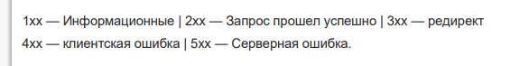

<div align="center"><h1></h1></div>

[⚙️ Back to menu](../README.md)

 <div id="menuother"></div>

| No.|             Вопрос                   |
|:---|:-------------------------------------|
|1| [Что такое HTTP ](#other1)
|2| [Из чего состоит HTTP запрос ](#other2)
|3| [Какие методы может иметь HTTP-запрос?](#other3)
|4| [Что такое HTTP cookie и для чего их используют?](#other4)
|5| [Что такое websockets? ](#other5)
|6| [Что такое REST API ](#other6)
|7| [Что такое WebRTC? ](#other7)
|8| [Что такое Git и его команды ](#other8)
|9| [Что такое SPA](#other9)
|10| [Как создать новую ветку и перейти на нее в Git? ](#other10)
|11| [Что такое Cross-Origin Resource Sharing (CORS)?](#other11)
|12| [Merge и rebase отличия. ](#other12)
|13| [Принципы ООП и классов](#other13)
|14| [Какие HTTP коды статусов есть](#other14)
|15| [Для чего нужен package.json? ](#other15)
|16| [метод OPTION (пред запрос, получает политики, доступные методы)](#other16)
|17| [Принципы `SOLID`](#other17)
|18| [что такое CDN (Content Delivery Network)](#other18)
|19| [Что такое Babel и для чего он используется?](#other19)
|20| [Стили написания составных слов в программировании](#other20)
|21| [JS паттерны (Singleton, Factory, Адаптер)](#other21)
|22| [unit-test](#other22)
|23| [Что такое Микрофронтенд, Webpack Module Federation](#other23)
|24| [Что такое Гидрация](#other24)
|25| [pwa (service-Workers)](#other25)
|26| [Agile](#other26)
|27| [Методологии работы, SCRUM](#other27)
|28| [Что такое сваггер?](#other28)
|29| [Что такое GraphQL?](#other29)
|30| [SSL](#other30)
|31| [MVC](#other31)
|32| [Сложность алгоритма, оптимизация, big O notation](#other32)
|33| [Что такое Content Security Policy (CSP)](#other33)|
|34| [Что такое Cross-Site Scripting (XSS)](#other34)|
|35| [CORS как работает, зачем нужен](#other35)|
|36| [CORS хедеры](#other36)|
|37| [Что такое preflight запросы, http метод OPTIONS](#other37)|
|38| [REST, какие есть принципы REST](#other38)|
|39| [Как работает HTTP, из чего состоит HTTP запрос](#other39)|
|40| [Как работает HTTPS и отличие от HTTP](#other40)|
|41| [HTTP отличия от HTTP 2.md](#other41)|
|42| [Отличие REST от GRAPHQL](#other42)|
|43| [Server Sent Events, Polling, Long Polling что это и как юзается](#other43)|
|44| [TCP, UDP что это и где используется, различия](#other44)|
|45| [Как работает протокол Websockets](#other45)|
|46| [Как работает браузер при вводе запроса, этапы рендера.md](#other46)|
|47| [Какие есть способы оптимизации приложений](#other47)|
|48| [Иммутабельность и Мутабельность](#other48)|
|49| [Отличия стека от очереди](#other49)|
|50| [Что такое DNS](#other50)|
|51| [Что такое JWT](#other51)|
|52| [Авторизация и Аутентификация](#other52)|
|53| [Access и refresh токены, что это и где безопасно хранить](#other53)|
|54| [Что делать если JWT токен истек](#other54)|
|55| [Cookie что это](#other55)|
|56| [Параметры настройки cookie (secure, httpOnly …)](#other56)|
|57| [SessionStorage и LocalStorage + отличия](#other57)|
|58| [Git merge vs rebase](#other58)|
|59| [Что такое простой запрос](#other59)|
|60| [HTTP методы, их отличия и особенности](#other60)|
|61| [Что такое WebRTC](#other61)|
|62| [Виды Уязвимостей в браузере и сетевые атаки](#other62)|
|63| [OWASP уязвимости в браузере](#other63)|
|64| [Что такое Same Origin Policy](#other64)|
|65| [Основные концепции Webpack, loaders, plugins](#other65)|
|66| [Отличия webpack modules, chunks, bundle](#other66)|
|67| [Виды протоколов](#other67)|
|68| [Как реализовать авторизацию на JWT](#other68)|

<div id="other1"></div>

## 1. Что такое HTTP

HTTP (Hypertext Transfer Protocol) - Протокол передачи гипертекста - это прикладной протокол для передачи гипертекстовых документов, таких как HTML. Он создан для связи между веб-браузерами и веб-серверами, хотя в принципе HTTP может использоваться и для других целей. Протокол следует классической клиент-серверной модели, когда клиент открывает соединение для создания запроса, а затем ждет ответа. HTTP - это протокол без сохранения состояния, то есть сервер не сохраняет никаких данных (состояние) между двумя парами "запрос-ответ". Несмотря на то, что HTTP основан на TCP/IP, он также может использовать любой другой протокол транспортного уровня с гарантированной доставкой.


Ниже перечислены общие функции, управляемые с HTTP:

- Кэш. Сервер может инструктировать прокси и клиенты: что и как долго кэшировать. Клиент может инструктировать прокси промежуточных кэшей игнорировать хранимые документы.

- Ослабление ограничений источника. Для предотвращения шпионских и других, нарушающих приватность, вторжений, веб-браузер обчеспечивает строгое разделеление между веб-сайтами. Только страницы из того же источника могут получить доступ к информации на веб-странице. Хотя такие ограничение нагружают сервер, заголовки HTTP могут ослабить строгое разделение на стороне сервера, позволяя документу стать частью информации с различных доменов (по причинам безопасности).

- Аутентификация. Некоторые страницы доступны только специальным пользователям. Базовая аутентификация может предоставляться через HTTP, либо через использование заголовка WWW-Authenticate и подобных ему, либо с помощью настройки спецсессии, используя куки.

- Прокси и тунелирование. Серверы и/или клиенты часто располагаются в интранете, и скрывают свои истинные IP-адреса от других. HTTP запросы идут через прокси для пересечения этого сетевого барьера. Не все прокси -- HTTP прокси. SOCKS-протокол, например, оперирует на более низком уровне. Другие, как, например, ftp, могут быть обработаны этими прокси.

- Сессии. Использование HTTP кук позволяет связать запрос с состоянием на сервере. Это создает сессию, хотя ядро HTTP -- протокол без состояния. Это полезно не только для корзин в интернет-магазинах, но также для любых сайтов, позволяющих пользователю настроить выход.

[Оглавление - Веб - технологии 🔼](#menuother)

<div id="other2"></div>

## 2. Из чего состоит HTTP-запрос?


Запросы содержат следующие элементы:

- HTTP-метод, обычно глагол подобно GET, POST или
существительное, как OPTIONS или HEAD, определяющее
операцию, которую клиент хочет выполнить. Обычно, клиент
хочет получить ресурс (используя GET) или передать
значения HTML-формы (используя POST), хотя другие
операция могут быть необходимы в других случаях.

- Путь к ресурсу: URL ресурсы лишены элементов, которые
очевидны из контекста, например без protocol (http://),
domain (здесь developer.mozilla.org), или TCP port (здесь
80).

- Версию HTTP-протокола.

- Заголовки (опционально), предоставляюшие дополнительную
информацию для сервера.

- Или тело, для некоторых методов, таких как POST, которое
содержит отправленный ресурс.

[Оглавление - Веб - технологии 🔼](#menuother)

<div id="other3"></div>

## 3. Какие методы может иметь HTTP-запрос?

HTTP-запрос может иметь следующие методы:

1. **GET**: Запросить данные от указанного ресурса. GET-запросы не должны изменять состояние сервера и должны быть идемпотентными, то есть многократное выполнение одного и того же запроса GET должно давать один и тот же результат.
2. **POST**: Отправить данные для создания нового ресурса на сервере.
3. **PUT**: Обновить существующий ресурс на сервере с предоставленными данными.
4. **DELETE**: Удалить указанный ресурс.
5. **HEAD**: Такой же, как GET, но сервер в ответе отправляет только заголовки и не отправляет тело ответа. Это полезно для извлечения метаданных и проверки наличия ресурса.
6. **OPTIONS**: Получить информацию о методах HTTP, поддерживаемых сервером для указанного URL.
7. **PATCH**: Применить частичные изменения к ресурсу.
8. **CONNECT**: Используется для установки сетевого соединения с помощью протокола HTTP для использования с прокси-серверами.
9. **TRACE**: Провести самопроверку с целью тестирования, что запрос был получен сервером в неизменном виде.

Методы HTTP также называются "глаголами" HTTP, потому что они определяют действие, которое должно быть выполнено на ресурсе. Самые распространенные из них - GET и POST.

[Оглавление - Веб - технологии 🔼](#menuother)

<div id="other4"></div>

## 4. Что такое HTTP cookie и для чего их используют?

HTTP-куки (или просто куки) — это небольшие фрагменты данных, которые серверы отправляют в браузер для хранения. Затем браузер возвращает эти данные обратно на сервер каждый раз, когда он делает новый запрос на этот сервер. Куки используются в различных целях, включая:

1. **Управление сессией**: Куки могут хранить информацию о состоянии сессии пользователя. Это может быть его статус входа в систему, содержимое корзины для интернет-магазинов или позиция на странице.

2. **Персонализация**: Куки могут хранить пользовательские предпочтения, такие как выбранный язык, тема сайта или другие настройки, которые делают использование сайта более удобным.

3. **Отслеживание**: Куки можно использовать для отслеживания действий пользователя на сайте, например, для аналитики веб-трафика или рекламных целей.

Куки состоят из имени и значения, а также атрибутов, таких как домен, путь, срок действия и другие.

Однако использование куки также подразумевает определенные проблемы с безопасностью и конфиденциальностью. Например, если куки, хранящие информацию о сессии, перехватываются, это может привести к утечке личной информации или возможности злоумышленником воспользоваться сессией пользователя. В связи с этим, для защиты данных пользователей, многие сайты и браузеры предлагают настройки управления куками, а также применяют дополнительные меры безопасности, такие как использование только защищенных куки (передаваемых по HTTPS), или установку атрибутов SameSite для предотвращения атак типа CSRF.

[Оглавление - Веб - технологии 🔼](#menuother)

<div id="other5"></div>

## 5. Что такое WebSocket? принцип его работы

подробнее - [WebSocket](https://learn.javascript.ru/websocket)

WebSocket - это протокол коммуникации, который обеспечивает полнодуплексное (двунаправленное) взаимодействие между клиентом и сервером через постоянное соединение. Этот протокол важен для веб-приложений, которые требуют мгновенного обновления данных без задержек, таких как онлайн-игры, чаты, торговые платформы и т.д.

Принцип работы WebSocket следующий:

1. **Установление соединения**: WebSocket-соединение устанавливается путем выполнения "рукопожатия" WebSocket, которое начинается с обычного HTTP-запроса от клиента к серверу. В этом запросе указывается, что клиент хочет установить WebSocket-соединение.

2. **Обмен данными**: После установления соединения клиент и сервер могут отправлять данные друг другу в любое время. Важно отметить, что данные передаются по уже установленному соединению, и для каждого обмена данными не нужно устанавливать новое соединение, как в случае с HTTP.

3. **Закрытие соединения**: Любая из сторон (клиент или сервер) может закрыть WebSocket-соединение в любое время. После закрытия соединения его нельзя повторно использовать, и для нового обмена данными требуется установить новое соединение.

Одно из ключевых преимуществ использования WebSocket - это снижение накладных расходов на данные. В отличие от HTTP, где каждый запрос и ответ сопровождаются заголовками и другими метаданными, WebSocket требует минимальных метаданных и позволяет эффективно передавать малые объемы данных.

[Оглавление - Веб - технологии 🔼](#menuother)

<div id="other6"></div>

## 6. Что такое REST API

REST API — это способ взаимодействия сайтов и веб-приложений с сервером. Его также называют RESTful.

Термин состоит из двух аббревиатур, которые расшифровываются следующим образом.

**API (Application Programming Interface)**  — это код, который позволяет двум приложениям обмениваться данными с сервера. На русском языке его принято называть программным интерфейсом приложения.

**REST (Representational State Transfer)**  — это способ создания API с помощью протокола HTTP. На русском его называют «передачей состояния представления».

Технологию REST API применяют везде, где пользователю сайта или веб-приложения нужно предоставить данные с сервера. Например, при нажатии иконки с видео на видеохостинге REST API проводит операции и запускает ролик с сервера в браузере. В настоящее время это самый распространенный способ организации API. Он вытеснил ранее популярные способы SOAP и WSDL.

У RESTful нет единого стандарта работы: его называют «архитектурным стилем» для операций по работе с сервером.

## **Принципы REST API**

У RESTful есть 7 принципов написания кода интерфейсов.

**Отделение клиента от сервера (Client-Server).** Клиент — это пользовательский интерфейс сайта или приложения, например, поисковая строка видеохостинга. В REST API код запросов остается на стороне клиента, а код для доступа к данным — на стороне сервера. Это упрощает организацию API, позволяет легко переносить пользовательский интерфейс на другую платформу и дает возможность лучше масштабировать серверное хранение данных.

**Отсутствие записи состояния клиента (Stateless).** Сервер не должен хранить информацию о состоянии (проведенных операций) клиента. Каждый запрос от клиента должен содержать только ту информацию, которая нужна для получения данных от сервера.

**Кэшируемость (Casheable).** В данных запроса должно быть указано, нужно ли кэшировать данные (сохранять в специальном буфере для частых запросов). Если такое указание есть, клиент получит право обращаться к этому буферу при необходимости.

**Единство интерфейса (Uniform Interface).** Все данные должны запрашиваться через один URL-адрес стандартными протоколами, например, HTTP. Это упрощает архитектуру сайта или приложения и делает взаимодействие с сервером понятнее.

**Многоуровневость системы (Layered System).** В RESTful сервера могут располагаться на разных уровнях, при этом каждый сервер взаимодействует только с ближайшими уровнями и не связан запросами с другими.

**Предоставление кода по запросу (Code on Demand).** Серверы могут отправлять клиенту код (например, скрипт для запуска видео). Так общий код приложения или сайта становится сложнее только при необходимости.

**Начало от нуля (Starting with the Null Style).** Клиент знает только одну точку входа на сервер. Дальнейшие возможности по взаимодействию обеспечиваются сервером.

## **Стандарты**

Сам по себе RESTful не является стандартом или протоколом. Разработчики руководствуются принципами REST API для создания эффективной работы серверов для своих сайтов и приложений. Принципы позволяют выстраивать серверную архитектуру с помощью других протоколов: HTTP, URL, JSON и XML.

Это отличает REST API от метода простого протокола доступа к объектам SOAP (Simple Object Access Protocol), созданного Microsoft в 1998 году. В SOAP взаимодействие по каждому протоколу нужно прописывать отдельно только в формате XML. Также в SOAP нет кэшируемости запросов, более объемная документация и реализация словаря, отдельного от HTTP. Это делает стиль REST API более легким в реализации, чем стандарт SOAP.

Несмотря на отсутствие стандартов, при создании REST API есть общепринятые лучшие [практики](https://tproger.ru/translations/luchshie-praktiki-razrabotki-rest-api-20-sovetov/), например:

-   использование защищенного протокола HTTPS
-   использование инструментов для разработки API Blueprint и Swagger
-   применение приложения для тестирования [Get Postman](https://blog.skillfactory.ru/glossary/postman/)
-   применение как можно большего количества HTTP-кодов ([список](https://ru.wikipedia.org/wiki/%D0%A1%D0%BF%D0%B8%D1%81%D0%BE%D0%BA_%D0%BA%D0%BE%D0%B4%D0%BE%D0%B2_%D1%81%D0%BE%D1%81%D1%82%D0%BE%D1%8F%D0%BD%D0%B8%D1%8F_HTTP))
-   архивирование больших блоков данных

## **Архитектура**

REST API основывается на протоколе передачи гипертекста HTTP (Hypertext Transfer Protocol). Это стандартный протокол в интернете, созданный для передачи гипертекста. Сейчас с помощью HTTP отправляют любые другие типы данных.

Каждый объект на сервере в HTTP имеет свой уникальный URL-адрес в строгом последовательном формате. Например, второй модуль обучающего видео про Python будет храниться на сервере по адресу _http://school.ru/python/2._

В REST API есть 4 метода HTTP, которые используют для действий с объектами на серверах:

-   GET (получение информации о данных или списка объектов)
-   DELETE (удаление данных)
-   POST (добавление или замена данных)
-   PUT (регулярное обновление данных)

Такие запросы еще называют идентификаторами CRUD: create (создать), read (прочесть), update (обновить) delete (удалить). Это стандартный набор действий для работы с данными. Например, чтобы обновить видео про Python по адресу  _http://school.ru/python/2_  REST API будет использовать метод PUT, а для его удаления — DELETE.

В каждом HTTP-запросе есть заголовок, за которым следует описание объекта на сервере — это и есть его состояние.


## **Как работает RESTful**

Например, на сайте отеля есть система бронирования номеров трех типов: эконом, стандарт и люкс. В REST API каждому типу будет присвоен свой URL на странице бронирования:

[http://hotel.ru/booking/econom](http://hotel.ru/booking/econom)

[http://hotel.ru/booking/standart](http://hotel.ru/booking/standart)

[http://hotel.ru/booking/lux](http://hotel.ru/booking/lux)

Такие URL однозначно определяют ресурс на сервисе — данные о доступных номерах каждого класса. Чтобы взаимодействовать с этими ресурсам REST API применяет CRUD-команды протокола HTTP. Например, GET econom для передачи клиенту информации о номерах класса эконом. В RESTful такие запросы будут кэшироваться — клиенту не нужно обращаться к серверу снова при повторном запросе.

Также такая архитектура позволяет расставить приоритеты в обслуживании. Например, использование более производительных серверов для запросов на номера класса люкс. Такую архитектуру легко масштабировать: при появлении новых классов номеров, система будет обращаться напрямуя к ресурсам по новым URL.

## **Где применяют**

REST API рекомендуют использовать в следующих случаях:

-   ограниченная пропускная способность соединения с сервером
-   есть необходимость кэшировать запросы
-   приложение или сайт будет значительно масштабироваться
-   приложение или сайт использует AJAX (метод фонового обмена данными с сервером)

REST API используют чаще альтернативных методов, например SOAP. Помимо сайтов и веб-приложений RESTful используют для облачных вычислений.

Например, REST API используется в социальной сети Twitter.  Запросы отправляются в формате JSON. Разработчики сторонних приложений могут использовать данные Twitter с помощью REST-запросов. Например:

[GET geo/id/:place_id](https://api.twitter.com/1.1/geo/id/:place_id.json)
Возвращает информацию о местоположении пользователей.

[GET geo/reverse_geocode](https://developer.twitter.com/en/docs/twitter-api/v1/geo/places-near-location/api-reference/get-geo-reverse_geocode)
Возвращает до 20 возможных местоположений по заданным координатам.
Возвращает местоположения, которые могут быть прикреплены к твитам.

[Оглавление - Веб - технологии 🔼](#menuother)

<div id="other7"></div>

## 7. Что такое REST API

WebRTC (Web Real-Time Communication) — это технология, которая позволяет веб-приложениям и сайтам передавать аудио-, видео- данные и общие данные в режиме реального времени без необходимости установки дополнительных плагинов или компонентов. WebRTC активно используется для создания приложений для видеозвонков, голосовых звонков, файлового обмена и прочих видов реального времени коммуникации.

WebRTC поддерживается большинством современных веб-браузеров и работает на базе нескольких основных API:

- getUserMedia: позволяет веб-приложению доступ к камере и микрофону пользователя.
- RTCPeerConnection: обеспечивает возможность передачи аудио и видео между браузерами.
- RTCDataChannel: позволяет двунаправленную передачу общих данных между браузерами.

Важной особенностью WebRTC является его способность работать в условиях NAT и файрволлов, а также обеспечивать защищенное соединение с использованием DTLS (Datagram Transport Layer Security) и SRTP (Secure Real-time Transport Protocol).

[Оглавление - Веб - технологии 🔼](#menuother)

<div id="other8"></div>

## 8. Что такое Git и его команды

Git — это система управления версиями, разработанная для ускорения и упрощения процесса работы с изменениями в коде, документах и других типах файлов, а также для согласования работы многих разработчиков над одним проектом.

Вот некоторые из основных команд Git:

1. `git init`: инициализирует новый Git-репозиторий в текущей директории.
2. `git clone <url>`: клонирует существующий репозиторий по указанному URL.
3. `git add <file>`: добавляет файл в область подготовленных к коммиту файлов (staging area).
4. `git commit -m "<message>"`: создает новый коммит со всеми изменениями из области подготовленных файлов, добавляя сообщение, описывающее эти изменения.
5. `git status`: показывает текущее состояние репозитория, включая какие файлы изменены, но не подготовлены к коммиту, какие подготовлены, какие не отслеживаются Git'ом и т. д.
6. `git pull`: забирает изменения из удаленного репозитория и объединяет их с текущей веткой.
7. `git push`: отправляет все локальные коммиты на удаленный репозиторий.
8. `git branch`: показывает список всех веток в репозитории, а также указывает, на какой ветке вы находитесь в данный момент.
9. `git checkout <branch>`: переключает на другую ветку в репозитории.
10. `git merge <branch>`: объединяет изменения из указанной ветки с текущей веткой.

[Оглавление - Веб - технологии 🔼](#menuother)

<div id="other9"></div>

## 9. Что такое SPA

SPA — это приложение, использующее единственный HTML-документ как оболочку и организующий взаимодействие с пользователем через динамически подгружаемые HTML, CSS, JavaScript.

[Оглавление - Веб - технологии 🔼](#menuother)

<div id="other10"></div>

## 10. Как создать новую ветку и перейти на нее в Git?

Создание новой ветки и переключение на нее в Git осуществляется следующим образом:

1. Чтобы создать новую ветку, используйте команду `git branch` с именем новой ветки. Например, если вы хотите создать ветку с именем `new-feature`, вы бы ввели следующую команду:

   ```bash
   git branch new-feature
   ```

   Эта команда создает новую ветку с именем `new-feature`, но она не переключает вас на эту ветку. В данный момент вы все еще находитесь на текущей ветке.

2. Чтобы переключиться на ветку `new-feature`, вы бы ввели команду `git checkout` с именем ветки:

   ```bash
   git checkout new-feature
   ```

   Теперь вы находитесь на ветке `new-feature` и можете начать делать коммиты в эту ветку.

Вместе с тем, если вы хотите создать новую ветку и сразу же переключиться на нее, вы можете сделать это в одной команде с использованием флага `-b` с командой `git checkout`:

```bash
git checkout -b new-feature
```

Эта команда создаст новую ветку с именем `new-feature` и немедленно переключит вас на нее.

[Оглавление - Веб - технологии 🔼](#menuother)

<div id="other11"></div>

## 11. Что такое Cross-Origin Resource Sharing (CORS)?

Cross-Origin Resource Sharing (CORS) — это механизм, который использует дополнительные HTTP-заголовки, чтобы разрешить клиенту доступ к выбранным ресурсам с сервера на источнике (домене), отличном от того, где находится сам клиент.

Домен, протокол или порт для URL клиента и URL ресурса должны совпадать, чтобы выполнялся так называемый "одинаковый источник" (same-origin). В противном случае, браузеры блокируют запросы из-за политики одного источника (Same-Origin policy), которая предотвращает чтение данных между сайтами для обеспечения безопасности. CORS позволяет серверам указывать, какие источники имеют разрешение на доступ к определенным ресурсам.

Когда клиент отправляет CORS-запрос, он добавляет `Origin` заголовок с текущим доменом. Если сервер позволяет этот источник, он включает `Access-Control-Allow-Origin` заголовок в ответ с этим доменом или `*` для разрешения всех доменов.

Если запрос более сложный, например, использует другой метод HTTP, кроме GET, POST или HEAD, или включает в себя свои собственные заголовки, браузер сначала отправляет предварительный запрос OPTIONS без тела, чтобы убедиться, что сам запрос безопасен для отправки.

[Оглавление - Веб - технологии 🔼](#menuother)

<div id="other12"></div>

## 12. Merge и rebase отличия (Git)

`Merge` и `Rebase` — это две стратегии объединения веток в Git, но они работают по-разному.

**Merge:**

- Команда `merge` берет содержимое из требуемой ветки и интегрирует его с текущей веткой.

- Создается новый коммит, который включает в себя изменения обеих веток.

- История коммитов сохраняется как есть. Это может привести к более сложной истории, но она более полная.

- Ветки, которые были объединены, могут быть видны в графе истории.

**Rebase:**

- Команда `rebase` переносит или "перебазирует" ветку на вершину другой ветки.

- Вместо создания нового коммита для объединения веток, rebase переписывает историю, перемещая коммиты ветки, которую перебазировали, так что они выглядят как будто были созданы после коммитов в ветке, на которую вы перебазировались.

- Это создает более "чистую", линейную историю.

- Однако, это также скрывает историю ветвления и слияния.

В общем, выбор между `merge` и `rebase` зависит от ваших целей. Если вы хотите сохранить историю точно такой, какая она была, используйте `merge`. Если вы хотите создать более чистую, линейную историю, используйте `rebase`. Но будьте осторожны с `rebase`, особенно с общедоступными ветками, потому что переписывание истории может создавать проблемы для других разработчиков.

[Оглавление - Веб - технологии 🔼](#menuother)

<div id="other13"></div>

## 13. Принципы ООП и классов

ООП – парадигма разработки, с использованием классов и обьектов, взаимодействующих друг с другом. 

Class в js класс – это разновидность функции. Это шаблон, на основании которого можно создавать объекты. Constructor это специальный метод, служащий для инициализации классов, и установки начальных значений экземпляра. Функции без замыкания – классы и функции конструкторы, которые вызываются с new

 - Абстракция - отделение концепции от ее экземпляра. Означает предоставление классу только необходимого функционала для задачи. Реализация, не имеет значения. Чтобы достичь абстракции в TypeScript, у вас есть несколько способов: абстрактный класс / метод, интерфейсы и типы. 

- Инкапсуляция основана на идее сокрытия данных, данные объекта не должны быть напрямую доступны. Здесь мы ограничиваем доступ к определенным свойствам или методам. Это можно сделать с помощью ключевых слов private, protected. Если же к свойствам и методам применяется модификатор private то к ним нельзя будет обратиться извне при создании экземпляра данного класса, для доступа к таким методам можно использовать get/set. Модификатор protected определяет поля и методы, которые из вне класса видны только в классах наследниках: 

- Наследование - способность объекта или класса базироваться на другом объекте или классе. Это главный механизм для повторного использования кода; Мы избегаем необходимости переписывать один и тот же код. Это позволяет на избежать дублирования общих свойств и методов у классов и сосредоточиться на написании уникальных свойств и методов для определенного класса. С помощью ключевого слова extends можно создать подкласс, который наследует свойства и метода базового класса. 

- Полиморфизм - реализация задач одной и той же идеи разными способами. Способность создавать классы, которые имеют одни и те же методы, но разные реализации. Например базовый класс имеет метод и в его дочернем классе мы переопределяем этот метод.

[Оглавление - Веб - технологии 🔼](#menuother)

<div id="other14"></div>

## 14. Какие HTTP коды статусов есть



[Оглавление - Веб - технологии 🔼](#menuother)

<div id="other15"></div>

## 15. Для чего нужен package.json?

Файл `package.json` в проекте Node.js или JavaScript представляет собой важный документ, который содержит различную метаинформацию о проекте. Вот некоторые из его основных функций:

1. **Метаданные проекта**: Это включает в себя имя проекта, версию, описание, автора, лицензию и т.д.

2. **Список зависимостей**: `package.json` указывает все модули, от которых зависит ваш проект. Это включает как "dependencies" (требуемые для работы проекта), так и "devDependencies" (необходимые только для разработки, например, модули для тестирования или сборки).

3. **Скрипты**: В файле `package.json` вы можете определить скрипты, которые можно запустить с помощью команды `npm run`. Это могут быть скрипты для сборки проекта, запуска тестов, локального сервера разработки и т.д.

4. **Настройки конфигурации**: Некоторые пакеты используют `package.json` для хранения своих конфигурационных настроек.

5. **Определение точки входа**: Это поле "main", которое определяет основной модуль вашего проекта.

С помощью этого файла другие разработчики могут понять структуру вашего проекта, его зависимости и как его использовать. Кроме того, при использовании системы управления пакетами, такой как npm или yarn, этот файл облегчает установку и управление зависимостями проекта.

[Оглавление - Веб - технологии 🔼](#menuother)

<div id="other16"></div>

## 16. метод OPTION (пред запрос, получает политики, доступные методы)

В протоколе HTTP, метод `OPTIONS` используется для получения информации о способах взаимодействия с ресурсом на сервере. В ответ на запрос OPTIONS, сервер обычно возвращает HTTP заголовок `Allow`, который содержит список методов, поддерживаемых для заданного ресурса. Это может включать методы, такие как `GET`, `POST`, `PUT`, `DELETE`, `PATCH`, `HEAD`, и так далее.

Метод `OPTIONS` также может использоваться для поддержки "preflight" запросов в контексте Cross-Origin Resource Sharing (CORS) в веб-приложениях. В этом контексте, браузер отправляет OPTIONS запрос к серверу для проверки, разрешено ли взаимодействие с этим сервером. Запрос OPTIONS включает заголовки, такие как `Origin` (исходный сайт, который делает запрос), `Access-Control-Request-Method` (метод, который будет использоваться в фактическом запросе) и `Access-Control-Request-Headers` (заголовки, которые будут использоваться в фактическом запросе). В ответ сервер может возвращать заголовки, такие как `Access-Control-Allow-Origin`, `Access-Control-Allow-Methods` и `Access-Control-Allow-Headers`, которые указывают на разрешенные источники, методы и заголовки.

Важно отметить, что метод OPTIONS не передает "тело" запроса или ответа, и не приводит к изменениям на сервере - он только запрашивает информацию о возможностях сервера.


[Оглавление - Веб - технологии 🔼](#menuother)


<div id="other17"></div>

## 17. Принципы `SOLID`

**SOLID** (сокр. от англ. single responsibility, open-closed,
Liskov substitution, interface segregation и dependency
inversion) это акроним, который в объектно-ориентированном программировании (ООП) относится к пяти основным принципам проектирования и написания кода. Эти принципы призваны упростить разработку программного обеспечения, делая его более читаемым, удобным для сопровождения и расширения. Вот эти принципы:

• `S` - Принцип единственной ответственности (The Single Responsibility Principle) каждый класс должен выполнять лишь одну задачу и все сервисы класса должны быть направлены на обеспечение этой обязанности. Например компонент должен отрисовать JSX и нежелательно чтобы axios/fetch запросы делались прямо в компонентах, это нужно выносить в отдельные переиспользуемые классы, функции, хуки. 

• `O` - Принцип открытости/закрытости (The Open Closed Principle) программные сущности должны быть открыты для расширения, но закрыты для модификации. В общем, этот принцип имеет в виду следующее: у нас должна быть возможность добавлять новый функционал, не трогая существующий код класса. 

• `L` - Принцип подстановки Барбары Лисков (The Liskov Substitution Principle) объекты в программе должны быть заменяемыми на экземпляры их подтипов без изменения правильности выполнения программы. Наследующий класс должен дополнять, а не изменять базовый. Для того чтобы следовать принципу необходимо в базовый (родительский) класс выносить только общую логику, характерную для классов наследников, которые будут ее реализовывать и, соответственно, можно будет базовый класс без проблем заменить на его класс-наследник. 

• `I` - Принцип разделения интерфейса (The Interface Segregation Principle) много интерфейсов, специально предназначенных для клиентов, лучше, чем один интерфейс общего назначения. Классы не должны реализовывать и зависить от методов, которые они не используют. Классы необходимо разделять на более специфические. В react – компоненты не должны зависеть от пропсов, которые они не юзают. 

• `D` - Принцип инверсии зависимостей (The Dependency Inversion Principle) классы должны зависеть от интерфейсов или абстрактных классов, а не от конкретных классов и функций. Высокоуровневые модули не должны зависеть от низкоуровневых модулей. Оба типа модулей должны зависеть от абстракций. 

[Оглавление - Веб - технологии 🔼](#menuother)

<div id="other18"></div>

## 18. что такое CDN (Content Delivery Network)

CDN, или Content Delivery Network (Сеть доставки контента), - это сеть географически распределенных серверов, которые работают вместе для более быстрой доставки интернет-контента. CDN позволяет быстро переносить данные (такие как HTML страницы, javascript файлы, стили, изображения и видео), необходимые для загрузки интернет-страниц.

CDN хранит копии контента на разных серверах в различных местах. Когда пользователь запрашивает контент (например, просматривает веб-страницу), CDN выбирает сервер, который находится ближе к пользователю, или который может обеспечить быстрейшую доставку контента.

Благодаря этому, CDN может уменьшить задержку загрузки, улучшить доступность и надежность контента, уменьшить нагрузку на основной сервер, и увеличить общую скорость загрузки сайтов для пользователей.

Использование CDN особенно полезно для сайтов с большим трафиком и для тех, которые имеют глобальную аудиторию, поскольку CDN может обеспечить быструю доставку контента, независимо от местоположения пользователя.

[Оглавление - Веб - технологии 🔼](#menuother)

<div id="other19"></div>

## 19. Что такое Babel и для чего он используется?

Babel - это инструмент для транспиляции (преобразования) JavaScript, который часто используется для преобразования кода ES6 (и новее) в более старый стандарт JavaScript (ES5), который поддерживается большинством браузеров.

С помощью Babel разработчики могут использовать новейшие функции и возможности JavaScript, не беспокоясь о том, что их код не будет работать в некоторых браузерах. Babel преобразует этот код в более старый JavaScript, который можно запустить практически в любом браузере.

Babel также поддерживает JSX, синтаксис, используемый в React для описания пользовательского интерфейса. Благодаря этому, Babel является ключевым инструментом в стеке технологий многих современных JavaScript-приложений, особенно тех, что используют React.

В добавок к основной функции транспиляции, Babel также поддерживает плагины и пресеты, которые позволяют разработчикам настраивать процесс преобразования, а также использовать ещё не стандартизированные возможности JavaScript.

[Оглавление - Веб - технологии 🔼](#menuother)

<div id="other20"></div>

## 20. Стили написания составных слов в программировании

В программировании, составные слова часто используются для обозначения переменных, функций, классов и других идентификаторов. Существуют различные стили написания составных слов, и выбор конкретного стиля часто зависит от языка программирования и принятых в сообществе соглашений. Вот некоторые из наиболее распространенных стилей:

1. **camelCase:** В этом стиле первое слово пишется с маленькой буквы, а все последующие слова начинаются с большой буквы. Например: `myVariableName`.

2. **PascalCase:** Этот стиль очень похож на camelCase, но первое слово также начинается с большой буквы. Например: `MyVariableName`. Этот стиль часто используется для именования классов в языках, таких как C# и Java.

3. **snake_case:** В этом стиле все слова пишутся с маленькой буквы, а слова разделяются символом подчеркивания. Например: `my_variable_name`. Этот стиль часто используется в языках, таких как Python и C.

4. **kebab-case:** В этом стиле все слова также пишутся с маленькой буквы, но слова разделяются дефисом. Например: `my-variable-name`. Этот стиль часто используется в именах CSS-классов и идентификаторах HTML.

Важно отметить, что разные языки программирования и разные проекты могут иметь свои собственные соглашения об именовании, поэтому всегда стоит прочитать документацию или руководство по стилю, принятое в конкретном контексте.

[Оглавление - Веб - технологии 🔼](#menuother)

<div id="other21"></div>

## 21. JS паттерны (Singleton, Factory, Адаптер)

JavaScript поддерживает различные паттерны проектирования, которые могут помочь в создании более модульного, масштабируемого и поддерживаемого кода. Ниже приведены краткие описания паттернов Singleton, Factory и Adapter.

1. **Singleton**: Этот паттерн гарантирует, что класс имеет только один экземпляр, и предоставляет глобальную точку доступа к нему. В JavaScript Singleton можно реализовать, используя модули, поскольку они гарантируют, что будет импортирован только один экземпляр.

   Пример Singleton в JavaScript:

   ```javascript
   let instance = null;

   class Singleton {
       constructor() {
           if (!instance) {
               instance = this;
           }

           return instance;
       }
   }
   ```

2. **Factory**: Factory - это паттерн, который используется для создания объектов без указания точного класса объекта, который будет создан. Вместо этого используется общий интерфейс, который делегирует создание объектов одной из нескольких возможных классов.

   Пример Factory в JavaScript:

   ```javascript
   class ProductFactory {
       createProduct(type) {
           let product;
           if (type === "Product1") {
               product = new Product1();
           } else if (type === "Product2") {
               product = new Product2();
           }
           return product;
       }
   }

   class Product1 {}
   class Product2 {}
   ```

3. **Adapter**: Adapter - это паттерн, который используется для преобразования интерфейса одного класса в интерфейс, который ожидает другой класс. Это полезно в ситуациях, когда у вас есть код, который ожидает определенный интерфейс, но вы хотите использовать класс с другим интерфейсом.

   Пример Adapter в JavaScript:

   ```javascript
   class OldClass {
       oldMethod() {}
   }

   class NewClass {
       newMethod() {}
   }

   class Adapter {
       constructor() {
           this.newClass = new NewClass();
       }

       oldMethod() {
           this.newClass.newMethod();
       }
   }
   ```

   В этом примере `Adapter` предоставляет метод `oldMethod`, который вызывает `newMethod` из `NewClass`. Это позволяет коду, который ожидает использовать `oldMethod`, работать с `NewClass`.

 [Оглавление - Веб - технологии 🔼](#menuother)

<div id="other22"></div>

## 22. unit-test

Unit-тестирование — это уровень тестирования программного обеспечения, где отдельные "единицы" программного кода проверяются на соответствие их предназначению. Единицей может быть отдельная функция, метод, процедура, модуль или объект.

Цель unit-тестирования — изолировать каждую часть программы и проверить ее независимо, что помогает выявить и исправить ошибки в ранние стадии разработки.

В JavaScript для написания unit-тестов обычно используются фреймворки, такие как Jest, Mocha или Jasmine. Вот пример простого unit-теста с использованием Jest:

```javascript
// Модуль, который мы тестируем
function sum(a, b) {
    return a + b;
}

// Тест
test('adds 1 + 2 to equal 3', () => {
    expect(sum(1, 2)).toBe(3);
});
```

В этом примере мы тестируем функцию `sum` для проверки того, правильно ли она складывает два числа. `expect(sum(1, 2)).toBe(3);` — это утверждение (assertion), которое проверяет, что результат выполнения функции `sum(1, 2)` равен `3`. Если это не так, тест будет считаться проваленным.

Unit-тесты являются краеугольным камнем практики Test-Driven Development (TDD), которая заключается в том, чтобы писать тесты перед написанием самого кода.

 [Оглавление - Веб - технологии 🔼](#menuother)

<div id="other23"></div>

## 23. Что такое Микрофронтенд, Webpack Module Federation

Микрофронтенды — это подход, при котором можно разделить приложение на отдельные модули и в рантайме объединять в единое приложение. 

Плюсы: улучшение масштабируемости, сервисы не зависят друг от друга, ошибка в 1 сервисе не крашнет другие. 

Минусы: более сложная конфигурация, проблемы с ci-cd, проблемы с шарингом состояния.

- host — сборка, которая будет подгружать другие модули 
- remote — сборка, которая будет загружена в host 
- exposed - модули, которые экспортируются из remote и будут доступны для импорта 
- shared - зависимости, которые будут совместно использоваться между различными приложениями
- singleton - если установлено значение true, то общий модуль будет загружаться только один раз, даже если он используется в нескольких приложениях. 
- requiredVersion: версия общего модуля, которая должна быть загружена 
- eager: если установлено значение true, то общий модуль будет загружен сразу при инициализации приложения, а не по требованию

[Оглавление - Веб - технологии 🔼](#menuother)

<div id="other24"></div>

## 24. Что такое Гидрация

Гидрация – это процесс, при котором серверно-сгенерированный HTML, прикрепляется и "гидрируется" на клиентской стороне, то есть превращается в действительные компоненты React. Процесс гидрации в SSR приложениях подразумевает, что сервер уже выполнил рендеринг компонентов React в виде HTML-кода. Когда клиент получает этот HTML-код, React берет на себя задачу гидрации, то есть он прикрепляет HTML-код к соответствующим компонентам на клиентской стороне и запускает клиентскую логику. Это позволяет клиенту продолжить интеракцию с приложением, отображать изменения без необходимости повторной загрузки всей страницы.

[Оглавление - Веб - технологии 🔼](#menuother)

<div id="other25"></div>

## 25. pwa (service-Workers)

Progressive Web Apps (PWA) - это веб-приложения, которые используют современные веб-технологии для предоставления приложения, которое очень похоже на нативное. Они могут работать в оффлайн-режиме, отправлять пользователю push-уведомления и даже быть установлены на главный экран мобильного устройства или на рабочий стол ПК, как нативное приложение.

Service Workers - это один из ключевых компонентов PWA. Это скрипты, которые работают в фоновом режиме, отдельно от веб-страницы, и позволяют разработчикам вводить такие возможности, как перехват сетевых запросов, кеширование ресурсов и управление push-уведомлениями.

Service Workers работают на уровне сети и могут обрабатывать все сетевые запросы, которые исходят из вашего приложения. Это позволяет вам решить, как ваше приложение должно вести себя в оффлайн-режиме или когда сеть ненадежна, предоставляя возможность кешировать ключевые ресурсы и предоставлять их из кеша, когда они недоступны.

PWA и Service Workers совместно предоставляют мощный инструментарий для создания веб-приложений, которые могут работать в условиях низкой скорости соединения или даже вовсе без подключения к интернету.

[Оглавление - Веб - технологии 🔼](#menuother)

<div id="other26"></div>

## 26. Agile

Agile, или гибкая методология, — это подход к управлению проектами, особенно популярный в разработке программного обеспечения, который подчеркивает гибкость, клиентоориентированность, и постоянное улучшение.

**Типы Agile-методологий**

Agile — это общее название нескольких методик, объединенных идеей гибкости работы. В эту группу входят разные методы, например:

- **Scrum**. Работа в этой методике строится по итерациям. Все задачи, необходимые для завершения продукта, формируются в специальный перечень — бэклог, а главная роль отведена заказчику, который определяет вид и функционал продукта.
- **Kanban**. В нем упор сделан на визуализации задач на досках и оптимизации рабочего процесса. Kanban-команды стремятся сократить время на реализацию проекта и повысить эффективность.
- **Extreme** Programming основывается на таких практиках, как парное программирование, разработка через тестирование и непрерывная интеграция, то есть постоянное добавление новых элементов в основной проект.

**Принципы Agile**

Agile-подход к разработке строится на нескольких принципах:

1. **Люди и взаимодействие важнее процессов и инструментов.** То есть команда и её динамика важнее, чем конкретные инструменты или процедуры, которые она использует.

2. **Работающий продукт важнее подробной документации.** Основная цель - создать работающее программное обеспечение, а не тратить слишком много времени на документацию. Однако это не означает, что документация не важна в Agile, но она не должна становиться препятствием для разработки.

3. **Сотрудничество с клиентом важнее контрактных условий.** Agile подразумевает тесное взаимодействие и сотрудничество с клиентом на протяжении всего процесса разработки, а не только в начале проекта при заключении контракта.

4. **Открытость к изменениям важнее следования первоначальному плану.** Agile признает, что требования могут меняться в процессе работы над проектом, и методология должна быть гибкой, чтобы адаптироваться к этим изменениям.

Scrum и Kanban — две из самых популярных методологий, основанных на принципах Agile. Они предоставляют конкретные рамки для реализации этих принципов в практике управления проектами.

[Оглавление - Веб - технологии 🔼](#menuother)

<div id="other27"></div>

## 27. Методологии работы, SCRUM

Scrum — это методология адаптивного управления проектами, которая основана на принципах Agile. Она используется в основном в области разработки программного обеспечения, но может быть применима и в других областях. Суть Scrum в том, чтобы разбивать большую работу на малые итерации, называемые спринтами.


Вот некоторые ключевые понятия и составляющие Scrum:

1. **Product Backlog**: Это упорядоченный список задач, которые нужно выполнить для создания и поддержания продукта. Он управляется владельцем продукта (Product Owner).

2. **Sprint**: Это короткий период времени (обычно 2-4 недели), в течение которого команда выполняет выбранные для данного спринта задачи из бэклога.

3. **Sprint Backlog**: Это подмножество Product Backlog, выбранное для выполнения в текущем спринте.

4. **Daily Scrum (или Stand-up)**: Краткая ежедневная встреча (обычно не более 15 минут), на которой каждый член команды сообщает, что он сделал вчера, что планирует делать сегодня, и какие препятствия у него возникли.

5. **Scrum Master**: Это человек, который помогает всем участникам проекта правильно использовать Scrum. Scrum Master убирает препятствия, которые мешают команде работать продуктивно, обеспечивает соблюдение процессов Scrum и помогает команде постоянно улучшаться.

6. **Review и Retrospective**: По окончании каждого спринта проводится Review (ревью), на котором команда демонстрирует результаты своей работы, и Retrospective (ретроспектива), на которой команда анализирует, что прошло хорошо, что плохо, и как можно улучшить процесс в следующем спринте.

Scrum ориентирован на сотрудничество, постоянное улучшение и гибкость при управлении проектами. Эта методология позволяет командам быстро адаптироваться к изменяющимся требованиям и обстоятельствам.

[Оглавление - Веб - технологии 🔼](#menuother)

<div id="other28"></div>

## 28. Что такое сваггер?

Swagger — это набор инструментов для разработки программного обеспечения, которые помогают разработчикам проектировать, строить, документировать и использовать RESTful веб-сервисы. Swagger был разработан компанией SmartBear Software и выпущен как бесплатный инструмент с открытым исходным кодом.

В Swagger есть несколько ключевых компонентов:

1. **Swagger UI**: Это библиотека, которая генерирует интерактивную документацию для RESTful API на основе Swagger-спецификации. Это позволяет разработчикам и пользователям просматривать и тестировать функциональность API без необходимости писать код.

2. **Swagger Editor**: Он позволяет разработчикам определить API с использованием Swagger-спецификации на YAML или JSON.

3. **Swagger Codegen**: Этот инструмент позволяет генерировать код клиента в различных языках программирования из Swagger-спецификации.

4. **Swagger Inspector**: Это инструмент для тестирования и валидации API, который поддерживает Swagger и OpenAPI спецификации.

Swagger является мощным инструментом для работы с API, который упрощает процесс документирования, тестирования и разработки API для разработчиков.

[Оглавление - Веб - технологии 🔼](#menuother)

<div id="other29"></div>

## 29. Что такое GraphQL?

GraphQL — это язык запросов для API, разработанный Facebook, который предлагает альтернативу REST и более эффективную обработку данных для клиента.

Вместо работы с фиксированным набором предопределенных "эндпоинтов" или URL-адресов, как в REST, с GraphQL вы отправляете запрос в единый эндпоинт и описываете, какие данные вы хотите получить. Это может быть намного более эффективно, поскольку вы получаете именно те данные, которые вам нужны, а не огромный набор данных, который вам придется фильтровать на стороне клиента.

Вот основные особенности GraphQL:

1. **Сильная типизация**: Все в GraphQL имеет ясно определенный тип, что делает схему предсказуемой.

2. **Иерархические запросы**: Запросы строятся в виде иерархии полей, что соответствует естественному образу данных в приложении.

3. **Сервер определяет, какие данные доступны**: Сервер предоставляет схему, описывающую, какие запросы клиент может сделать.

4. **Клиент определяет, какие данные ему нужны**: Вместо получения фиксированного набора данных для каждого эндпоинта, как в REST, с GraphQL клиент может указать именно те данные, которые ему нужны.

5. **Эффективная обработка данных**: Это может сократить необходимое количество запросов к серверу, поскольку клиент может запрашивать несколько наборов данных в одном запросе.

GraphQL предоставляет мощные инструменты для работы с данными и позволяет разработчикам и клиентам иметь больше контроля над данными, которые они запрашивают и получают.

[Оглавление - Веб - технологии 🔼](#menuother)

<div id="other30"></div>

## 30. SSL

SSL (Secure Sockets Layer) - это протокол защиты, который обеспечивает зашифрованное соединение между двумя компьютерами или устройствами через Интернет. SSL используется для обеспечения безопасности данных, передаваемых между клиентом и сервером. Это может включать в себя информацию, такую как личные данные, номера кредитных карт и другие виды конфиденциальной информации.

Когда вы видите URL, начинающийся с "https://", а не с "http://", это означает, что сайт использует SSL для шифрования данных, передаваемых между вами (или вашим браузером) и сайтом.

SSL использует так называемые "SSL сертификаты", которые подтверждают идентификацию сервера и содержат ключ, используемый для шифрования и дешифрования данных.

Важно отметить, что современный стандарт, который сейчас используется, называется TLS (Transport Layer Security) и является обновленной версией SSL. Но термин "SSL" продолжает использоваться в обиходе и часто обозначает технологии, основанные на протоколе TLS.

[Оглавление - Веб - технологии 🔼](#menuother)

<div id="other31"></div>

## 31. MVC

MVC, или Model-View-Controller, — это шаблон проектирования, который используется для структурирования кода в приложениях, особенно в веб-приложениях. MVC разделяет приложение на три основных компонента: Модель (Model), Представление (View) и Контроллер (Controller).

1. **Model (Модель)**: Это часть системы, которая отвечает за данные и правила, которые обрабатывают данные. Модели не знают о существовании контроллеров и представлений. Их задача - поддерживать данные и выполнять операции с этими данными на основе команд, полученных от контроллера.

2. **View (Представление)**: Представления отвечают за то, как данные отображаются пользователям. Они используют данные из моделей для создания пользовательского интерфейса, например, веб-страницы или окна приложения. Представления не знают об изменениях в данных, они просто отображают текущее состояние модели.

3. **Controller (Контроллер)**: Контроллеры связывают модели и представления. Они обрабатывают ввод пользователя, обновляют модель в соответствии с этим вводом, и затем обновляют представление, чтобы отразить новое состояние модели.

Помимо упорядочивания кода, MVC также помогает изолировать различные аспекты приложения для независимой разработки и тестирования. Команда разработчиков может работать над моделями, в то время как другие могут работать над представлениями или контроллерами, зная, что их работа не будет взаимно мешать друг другу.

[Оглавление - Веб - технологии 🔼](#menuother)


<div id="other32"></div>

## 32. Сложность алгоритма, оптимизация, big O notation

**Сложность алгоритма** — это количественная оценка того, насколько быстро растет время выполнения алгоритма при увеличении размера входных данных. Это концепция, которая используется в информатике для сравнения эффективности различных алгоритмов.

Существуют два вида сложности алгоритма: временная и пространственная.

- **Временная сложность** относится к количеству времени, которое требуется алгоритму, чтобы выполниться.
- **Пространственная сложность** относится к количеству памяти, которую алгоритм требует для выполнения.

**Оптимизация** алгоритма обычно включает в себя уменьшение его временной или пространственной сложности, или обоих. Это может быть достигнуто различными способами, включая улучшение структуры данных, использование более эффективных операций или изменение подхода к решению проблемы.

**Big O Notation** — это способ описания временной сложности алгоритма. Она позволяет оценить, как быстро растет время выполнения алгоритма при увеличении размера входных данных. Основные классы сложности, которые часто встречаются, включают O(1) (константное время), O(n) (линейное время), O(n^2) (квадратичное время), O(log n) (логарифмическое время) и O(n log n).

Примеры:

- **O(1)** означает, что время выполнения алгоритма постоянно, независимо от размера входных данных.
- **O(n)** означает, что время выполнения алгоритма пропорционально размеру входных данных.
- **O(n^2)** означает, что время выполнения алгоритма пропорционально квадрату размера входных данных.
- **O(log n)** означает, что время выполнения алгоритма пропорционально логарифму размера входных данных.
- **O(n log n)** означает, что время выполнения алгоритма пропорционально размеру входных данных, умноженному на логарифм размера входных данных.

---
**Виды сортировок**

1. **Сортировка пузырьком**: Это простой алгоритм сортировки, который многократно проходит по списку, сравнивает соседние элементы и меняет их местами, если они в неправильном порядке. Сложность алгоритма составляет O(n^2).

2. **Сортировка вставками**: Этот алгоритм сортировки работает, вставляя каждый элемент списка на правильное место в отсортированной части списка. Сложность алгоритма составляет O(n^2).

3. **Сортировка выбором**: Этот алгоритм сортировки работает, выбирая наименьший (или наибольший, в зависимости от порядка сортировки) элемент из неотсортированных элементов и перемещая его в начало неотсортированной части. Сложность алгоритма составляет O(n^2).

4. **Сортировка слиянием**: Этот алгоритм разбивает список на две половины, сортирует их отдельно, а затем сливает отсортированные половины вместе. Сложность алгоритма составляет O(n log n).

5. **Быстрая сортировка**: Это один из самых быстрых и наиболее широко используемых алгоритмов сортировки. Он выбирает элемент, называемый "опорным", и разбивает список на две части: элементы меньше опорного и элементы больше опорного. Затем он рекурсивно сортирует эти две части. Средняя сложность алгоритма составляет O(n log n), хотя в худшем случае она может достигать O(n^2).

**Виды поиска**

1. **Линейный поиск**: Это самый простой алгоритм поиска. Он проходит по каждому элементу списка по порядку, пока не найдет искомый элемент. Сложность алгоритма составляет O(n).

2. **Бинарный поиск**: Этот алгоритм поиска использует "разделяй и властвуй" подход для быстрого нахождения элемента в отсортированном списке. Он сначала проверяет средний элемент списка; если средний элемент меньше искомого, то поиск продолжается в правой половине списка, и наоборот. Это продолжается, пока не будет найден искомый элемент или пока не останется элементов для проверки. Сложность алгоритма

[Оглавление - Веб - технологии 🔼](#menuother)

<div id="other33"></div>

## 33. Что такое Content Security Policy (CSP)

Политика безопасности контента (CSP) - это HTTP-header, который позволяет операторам сайта детально контролировать, откуда могут быть загружены ресурсы на их сайт. Использование этого заголовка - лучший способ предотвратить уязвимости межсайтового скриптинга (XSS). CSP является обязательным для всех новых веб-сайтов и настоятельно рекомендуется для всех существующих сайтов с высоким уровнем риска.

[Оглавление - Веб - технологии 🔼](#menuother)

<div id="other34"></div>

## 34. Что такое Cross-Site Scripting (XSS)

Cross-Site Scripting (XSS) — это тип атаки на веб-приложения, при котором злоумышленники внедряют вредоносные скрипты в контент, отображаемый другим пользователям. Эти вредоносные скрипты обычно внедряются в веб-страницы через формы ввода, такие как поля комментариев, и затем сохраняются на сервере. При загрузке страницы другими пользователями эти вредоносные скрипты выполняются в их браузерах.

Существуют три основных типа XSS-атак:

1.  **Stored XSS (Постоянный)**: Это наиболее опасный тип атаки XSS. Вредоносный скрипт сохраняется на сервере и затем отправляется всем пользователям, которые просматривают соответствующую страницу. Это может произойти, например, если вредоносный скрипт вставляется в комментарий на блоге, который затем отображается всем посетителям этого блога.

2.  **Reflected XSS (Отраженный)**: Этот тип атаки происходит, когда вредоносный скрипт внедряется через URL. URL, содержащий вредоносный скрипт, затем может быть отправлен жертве, и скрипт будет выполнен в браузере жертвы, когда жертва перейдет по URL.

3.  **DOM-based XSS (Основанный на DOM)**: Этот тип атаки происходит, когда вредоносный скрипт вносит изменения в структуру DOM веб-страницы, что приводит к выполнению вредоносного кода.


Для предотвращения атак XSS важно правильно обрабатывать и экранировать ввод пользователя, чтобы предотвратить выполнение вредоносного кода. Также полезно использовать Content Security Policy (CSP) для ограничения источников, из которых разрешено загружать скрипты.

[Оглавление - Веб - технологии 🔼](#menuother)

<div id="other35"></div>

## 35. CORS как работает, зачем нужен

CORS (Cross-Origin Resource Sharing) механизм, который использует дополнительные заголовки HTTP, чтобы дать браузерам указание предоставить веб-приложению, работающему в одном источнике, доступ к ответу на запрос к ресурсам из другого источника. Это браузерная политика. Например чтобы не было возможности у вредоносного сайта делать межсайтовый запрос и получить результат этого запроса, потому что с запросом могут отправиться файлы cookie вашего действующего сеанса на оригсайте и авторизационные куки могут попасть на вредоносный сайт.

[Оглавление - Веб - технологии 🔼](#menuother)

<div id="other36"></div>

## 36. CORS хедеры

Access-Control-Allow-Origin - заголовок определяет, какие источники могут получать ответ от сервера. Механизм CORS, проверяет совпадение значений заголовка ответа Access-Control-Allow-Origin и заголовка запроса Origin (Источник с которого ушел запрос). 

Access-Control-Allow-Credentials заголовок сообщает браузерам, разрешает ли сервер запросам отправлять учетные данные, такие как куки, заголовки авторизации и тд. 

Access-Control-Allow-Methods - заголовок указывает, какие HTTP-методы разрешены при доступе к ресурсам.

[Оглавление - Веб - технологии 🔼](#menuother)

<div id="other37"></div>

## 37. Что такое preflight запросы, http метод OPTIONS

Если запрос не является простым, в случае cross-origin запроса (на другой домен), перед отправкой фактического запроса, делается preflight OPTIONS запрос с информацией о запросе: о его методе, дополнительных заголовках и тд. Сервер получает этот запрос и отправляет ответ, содержащий CORSзаголовки. Браузер получает этот ответ и проверяет, будет ли разрешен фактический запрос. preflight заранее чекает есть ли разрешение на доступ к домену, только после этого позволяет отправить основной запрос.

Способы пофиксить корс ошибку: 
- Написать бекендеру, чтобы добавил наш домен в список доступных источников, чтобы бэк мог обрабатывать запросы с нашего домена. И тогда в ответе на запрос будет приходить хедер AccessControl-Allow-Origin с нашим адресом 
- Можно отключить CORS-проверки в браузере 
- Отключить корсы с помощью расширения для браузера, но работает не всегда и не для всех запросов 
- Настроить прокси сервер, чтобы перенаправлял запросы

[Оглавление - Веб - технологии 🔼](#menuother)

<div id="other38"></div>

## 38. REST, какие есть принципы REST

Representational State Transfer (REST) – это способ взаимодействия сайтов и веб-приложений с сервером. Это программный интерфейс (API), который использует HTTP-запросы для получения, извлечения, изменения и удаления данных. Архитектурный подход

Принципы REST API 
- Отделения клиента от сервера (Client-Server). 
- Отсутствие записи состояния клиента (Stateless). 
- Кэшируемость (Casheable). 
- Единство интерфейса (Uniform Interface).  
- Многоуровневость системы (Layered System). 
- Предоставление кода по запросу (Code on Demand).

[Оглавление - Веб - технологии 🔼](#menuother)

<div id="other39"></div>

## 39. Как работает HTTP, из чего состоит HTTP запрос

HTTP — протокол прикладного уровня передачи данных, изначально предназначенный для передачи гипертекстовых документов. Используется для передачи произвольных данных между клиентом и сервером. HTTP является однонаправленным (запросы идут от клиента к серверу) и работает по принципу запрос — ответ. При каждом запросе браузер устанавливает TCP соединение, получает ответ с сервера и разрывает соединение. 

Передача данных по протоколу HTTP осуществляется через TCP/IP соединения

![[Pasted image 20240511152109.png]]

[Оглавление - Веб - технологии 🔼](#menuother)

<div id="other40"></div>

## 40. Как работает HTTPS и отличие от HTTP

HTTPS — защищённый протокол передачи гипертекста. HTTPS обеспечивает шифрованную связь между клиентом и сервером. расширение протокола HTTP для поддержки шифрования в целях повышения безопасности. Протокол HTTPS шифрует передаваемые сообщения с помощью протокола TLS или уже устаревшего SSL. 

TLS протокол нужны для подтверждения подлинности сайтов и шифрования сетевого соединения между сайтом и браузером.

[Оглавление - Веб - технологии 🔼](#menuother)

<div id="other41"></div>

## 41. HTTP отличия от HTTP 2

В отличие от текстового HTTP протокола, HTTP/2 – бинарный (двоичный), бинарные сообщения обрабатываются быстрее текста. МУЛЬТИПЛЕКСИРОВАНИЕ - позволяет увеличить скорость передачи данных в HTTP2. В HTTP1.1 для каждого запроса требуется устанавливать отдельное TCP-соединение. Мультиплексирование же позволяет браузеру выполнять множество запросов в рамках одного TCPсоединения.

[Оглавление - Веб - технологии 🔼](#menuother)

<div id="other42"></div>

## 42. Отличие REST от GRAPHQL

Различие: в REST структура и объем ресурса определяются сервером. В GraphQL клиент может запрашивать именно те данные, которые ему нужны, указывая в запросе необходимые поля. Все запросы проходят через один endpoint – /graphql, есть система типов, Для запросов создаются mutations, resolvers, query, schema.

Основные отличия REST от GraphQL:

1. Архитектура: REST использует архитектуру "клиент-сервер", где клиент и сервер обмениваются сообщениями через протокол HTTP. GraphQL использует один конечный пункт для всех запросов и ответов.
2. Запросы: В REST клиент должен делать несколько запросов, чтобы получить все необходимые данные. В GraphQL клиент может запрашивать только те данные, которые ему нужны, и получать их в одном запросе.
3. Типизация: В REST типизация данных не обязательна. В GraphQL используется типизированная схема для описания данных и их взаимосвязей.
4. Ответы: В REST сервер определяет структуру ответа. В GraphQL клиент может определять структуру ответа, запрашивая только те данные, которые ему нужны.
5. Все запросы проходят через один endpoint – /graphql

[Оглавление - Веб - технологии 🔼](#menuother)

<div id="other43"></div>

## 43. Server Sent Events, Polling, Long Polling что это и как юзается

Polling - периодический опрос сервера, то есть например мы каждые 5сек. делаем запрос за данными. Минусы: задержка между запросами, запросы отправляются каждые 5сек, а не только когда надо, т.е более ресурсоемкий + на каждый запрос устанавливается новое ТСП соединение 

Long Polling — это способ, когда сервер получает запрос, но отправляет ответ на него не сразу, а лишь тогда, когда произойдет какое-либо событие либо истечет таймаут соединения. После отправляется еще 1 запрос. Минусы: имеет большую задержку чем WS, более ресурсоемкий, возможно потеря сообщений. 

Server Sent Events - позволяет поддерживать HTTP соединение с сервером и получать от него события. В отличие от WebSockets, SSE является однонаправленным: сообщения отправляются в одном направлении - от сервера к клиенту. Если соединение разрывается, класс EventSource автоматически пытается восстановить его. Стоит юзать, например для уведомлений, или ленты новостей, чтобы обновлять когда появляется новая.

[Оглавление - Веб - технологии 🔼](#menuother)

<div id="other44"></div>

## 44. TCP, UDP что это и где используется, различия

TCP (Протокол Управления Передачей) - протокол сети, который позволяет двум хостам создать соединение и обмениваться потоками данных. Он гарантирует доставку данных в том же порядке, в котором они были отправлены. Чтобы обеспечить гарантию доставки данных, TCP использует подтверждение получения сегментов, при ошибке, если не пришло подтверждения получения и сегмент отправляется повторно. 

UDP (User Datagram Protocol), более прост. Для передачи данных ему не обязательно устанавливать соединение между отправителем и получателем. Информация передается без проверки готовности принимающей стороны. Это делает протокол менее надежным – при передаче некоторые фрагменты данных могут теряться. Также, упорядоченность данных не соблюдается, но имеет более высокую скорость передачи данных. Подходит для видео/аудио звонков. 

Отличие от HTTP: TCP и UPD - это протоколы транспортного уровня, а HTTP-это протокол прикладного уровня, который работает поверх TCP.

TCP/IP — это стек протоколов, которые задают правила передачи данных по Сети. TCP (Transmission Control Protocol) отвечает за обмен данными. Он управляет их отправкой и следит за тем, чтобы они дошли до получателя в целости. IP (Internet Protocol) отвечает за передачу пакетов данных между устройствами в сети. Его задача — связывать друг с другом устройства.

[Оглавление - Веб - технологии 🔼](#menuother)

<div id="other45"></div>

## 45. Как работает протокол Websockets

WebSockets - это протокол, позволяющий открыть постоянное двунаправленное сетевое соединение между клиентом и сервером с возможностью обмена данными. Этот процесс начинается с того, что клиент отправляет серверу HTTP-запрос c заголовком Upgrade: websocket. 

- С Websocket: браузер единоразово устанавливает TCP соединение для обмена данными. А в REST, при каждом HTTP-запросе браузер устанавливает TCP соединение, получает данные с сервера и разрывает соединение. 
- WebSocket является двунаправленным, то есть любой клиент / сервер может отправить сообщение другой стороне, а HTTP является однонаправленный т.к запрос всегда отправляется клиентом, а ответ обрабатывается сервером 
- WebSocket - протокол с отслеживанием состояния, а REST не хранит состояние, т.е. клиенту не нужно знать о сервере, и то же самое относится и к серверу.

[Оглавление - Веб - технологии 🔼](#menuother)

<div id="other46"></div>

## 46. Как работает браузер при вводе запроса, этапы рендера

1. Браузер парсит URL и ищет в своём кэше запись о DNS сервере соответствующего IP-адреса. Если ее нет, то запрашивает DNS запись. При нахождении нужного DNS сервера IP сохраняется в кеше устройства. Запрос содержит имя сервера, который должен быть преобразован в IP-адрес.

2. Когда IP адрес становится известен, браузер начинает установку соединения к серверу с помощью TCP рукопожатия. Выполняется обмен флагами в 3 этапа: SYN, SYN-ACK и ACK для согласования параметров и подтверждения соединения.

3. Когда мы установили соединение, браузер отправляет GET запрос для получения HTML файла.

4. Полученный от сервера HTML-документ браузер преобразует в DOM дерево.

5. Загружаются и парсятся css-стили, формируется CSSOM (CSS Object Model). Загружается JS, если при парсинге html встречается script, то он блокирует дальнейший рендер, пока скрипт не отработает

6. На основе DOM и CSSOM формируется дерево рендеринга, или render tree — набор объектов рендеринга. Render tree дублирует структуру DOM, но сюда не попадают невидимые элементы (например — <head>, или элементы со стилем display:none;). Также, каждая строка текста представлена в дереве рендеринга как отдельный renderer. Каждый объект рендеринга содержит соответствующий ему объект DOM и рассчитанный для этого объекта стиль. Проще говоря, render tree описывает визуальное представление DOM.

 7. Для каждого элемента render tree рассчитывается положение на странице и его размеры, высота, ширина, происходит стадия layout.

8. Происходит отрисовка каждого отдельного узла в браузере — painting.

9. Происходит Composition - это конечная отрисовка элементов на странице. Браузер на этом этапе группирует различные элементы по слоям, чтобы вынести какие-то вычисления в отдельный слой, чтобы они исполнялись на видеокарте и не нагружали процессор. (единственный этап, который выполняется на GPU). На этом этапе выполняются только определенные стили CSS, такие как `transform` и `opacity`    
Есть два свойства которые вызывают задачу composite — это opacity и transform. Эти два свойства являются самыми дешевыми для анимации.

[Оглавление - Веб - технологии 🔼](#menuother)

<div id="other47"></div>

## 47. Какие есть способы оптимизации приложений

**Оптимизация** приложения, можно вкратце назвать весь список:

- Сжатие Gzip - уменьшит объем данных, передаваемых сервером хостинга, браузеру клиента (обычно включено по умолчанию)

- Использование CDN для хранения изображений и других ресурсов

- Кеширование статики, шрифтов, изображений и так далее

- Разбитие кода на чанки

- Использование HTTP 2 вместо HTTP 1

- Lazy loading - чтобы код подгружался не весь сразу при первой загрузке приложения, а только в тот момент, когда это будет нужно пользователю

- Борьба с лишними ререндерами с помощью useMemo, useCallback, memo

- Использовать Web-worker для выноса блокирующего кода, или тяжелых операций в отдельный поток

- Использовать виртуализацию или пагинацию для больших списков и таблиц

**Поподробнее**:

- Можем использовать lazy loading и разбиение на чанки, например с помощью React.lazy импортов и Suspense, чтобы у нас код подгружался не весь сразу при первой загрузке приложения, а небольшими частями в тот момент, когда это будет нужно.  
 - Можем использовать webpack минимайзеры css и js файлов (UglifyJsPlugin, Terser, MiniCssExtract), плагин для tree-shaking в webpack, кеширование статических файлов. Tree shaking – это удаление кода и импортов, которые фактически не используются.

- Можем использовать react.memo, usecallback, usememo для уменьшения количества ререндеров, - например в больших списках

- Использование виртуализации больших списков, чтобы рендерилось, например не 1000 элементов, а только те которые юзер видит на экране

- Оптимизация изображений - использование CDN, например s3 для хранения изображений, помогает уменьшить время подгрузки, так как данные будут подгружаться с ближайшего к юзеру сервера. Использовать Lazy loading images, Progressive Images

- Использование debounce/throttle, например в фильтрах, инпутах для поиска, чтобы запросы отправлялись не на каждый ввод в инпут, а с какой-то задержкой


**Throttle** – запускает вызовы функции с определённой периодичностью (как setInterval)

**Debounce** - откладывает вызов функции до того момента, когда с последнего вызова пройдёт заданное количество времени, которое мы передали в функцию (как setTimeout)


**Способы измерения производительности и метрик** –

- Вкладка performance в devtools,

- Lighthouse в девтулз для измерения метрик производительности,

- Использование Web-vitals,

- расширение React-profiler для отслеживания лишних ререндеров

- замер метрик с помощью сайта WebpageTest

[Оглавление - Веб - технологии 🔼](#menuother)

<div id="other48"></div>

## 48. Иммутабельность и Мутабельность

**Иммутабельность** означает, что **объект не может быть изменён после его создания**. Это подход при котором массивы и объекты не изменяются напрямую, а сначала копируются, а потом изменяются. Это делает код более надёжным и предсказуемым. К минусам можно отнести большее использование памяти, т.к когда мы копируем обьект выделяется память.

**Мутабельность** означает возможность изменять значение переменной или объекта после его создания.

[Оглавление - Веб - технологии 🔼](#menuother)

<div id="other49"></div>

## 49. Отличия стека от очереди

![[Pasted image 20240511154339.png]]

[Оглавление - Веб - технологии 🔼](#menuother)

<div id="other50"></div>

## 50. Что такое DNS

DNS – это Система доменных имён которая ведёт список доменных имён вместе с их числовыми IP адресами или местонахождениями. 

Браузер получает запрос от пользователя и направляет его DNS-серверу сети, который ищет совпадение доменного имени и сетевого адреса. Если ответ обнаружен, то страница сайта загружается сразу. В противном случае запрос будет отправлен серверу более высокого уровня или корневому.
 
[Оглавление - Веб - технологии 🔼](#menuother)

<div id="other51"></div>

## 51. Что такое JWT

JWT токен — это строка, которая состоит из трех частей: заголовок header (информация о хешировании), полезные данные payload (например id или роль юзера), и подпись signature. Чтобы обезопасить - токены лучше хранить в куках с флагами secure и httponly, не передавать в токенах чувствительные пользовательские данные, ограничить время жизни JWT

[Оглавление - Веб - технологии 🔼](#menuother)

<div id="other52"></div>

## 52. Авторизация и Аутентификация

Авторизация- это проверка прав пользователя на доступ к определенным ресурсам.

Аутентификация- это процесс проверки учётных данных пользователя (логин/пароль). Проверка подлинности пользователя путём сравнения введённого им логина/пароля с данными сохранёнными в базе данных.

[Оглавление - Веб - технологии 🔼](#menuother)

<div id="other53"></div>

## 53. Access и refresh токены, что это и где безопасно хранить

access token - используется для авторизации запросов и хранения дополнительной информации о пользователе (user_id, user_role или еще что либо). Более короткоживущий токен.

refresh token - выдается сервером по результам успешной аутентификации (логин/рег) и используется для получения новой пары access/refresh токенов. Имеет большой срок жизни.

jwt Токены лучше хранить в куках с флагами secure и httponly
ЛокалСтораж уязвим к XSS-атакам и злоумышленник может внедрить вредоносный JS скрипт на сайте и получить доступ к токену, сохранённому в localStorage. А к HttpOnly кукам нельзя получить доступ через JS. 

Куки уязвимы к CSRF (Межсайтовая подделка запроса) - это вид атаки, позволяющий злоумышленнику выполнить запрос от лица пользователя. Для защиты можно юзать SameSite=strict чтобы кука не отправлялась при кросс-доменном запросе.

[Оглавление - Веб - технологии 🔼](#menuother)

<div id="other54"></div>

## 54. Что делать если JWT токен истек

Если JWT токен истек, то для его обновления можно использовать axios-interceptors, redux-middleware, делать проверку в RTK Query FetchBaseQuery, и если нужно перезапрашивать токен

[Оглавление - Веб - технологии 🔼](#menuother)

<div id="other55"></div>

## 55. Cookie что это

HTTP cookie - это фрагмент данных, который сервер отправляет браузеру пользователя. Браузер может сохранить этот фрагмент и отправлять на сервер с каждым последующим запросом. Максимальный размер для браузера – 4 КБ. Чтобы включить отправку кук – withCredentials.

[Оглавление - Веб - технологии 🔼](#menuother)

<div id="other56"></div>

## 56. Параметры настройки cookie (secure, httpOnly …)

Безопаснее хранить токен в куках, с флагами secure+httponly, потому что можно запретить доступ к куке из javascript. Таким образом, если кто-то проведет XSS атаку и сможет выполнить js-код у другого пользователя, он не сможет украсть у него токен, так как к куке нет доступа из JS. 

httpOnly - Эта настройка запрещает любой доступ к куки из JavaScript. Мы не можем видеть такое куки или манипулировать им с помощью document.cookie. Так можно избежать XSS-атак 

samesite - определяет, может ли данная кука быть отправлена при кросс-доменном запросе. Значение параметра strict будет предотвращать отправку на другие домены, а lax разрешит отправлять куки с GET-запросами.

secure - указывает, что данная кука может быть передана только при запросах по защищённому протоколу HTTPS.

max-age и expires - определяет время жизни куки. 

Domain - хосты на которые отсылаются куки, по умолчанию будет равен хосту сайта.

[Оглавление - Веб - технологии 🔼](#menuother)

<div id="other57"></div>

## 57. SessionStorage и LocalStorage + отличия

SessionStorage хранит данные (до 5мб) только во время текущей сессии (для вкладки, пока она открыта). Закрытие вкладки приводит к очищению этих данных. При этом данные сохраняются при обновлении страницы или отображение в этой вкладке другой страницы из этого же источника. В отличие от sessionStorage, localStorage хранит данные в течение неограниченного количества времени. Они сохраняются при закрытии браузера и выключения компьютера.

LocalStorage это свойство объекта window, предназначенное для хранения пар ключ/значение в браузере. В зависимости от браузера, мы можем сохранять до 5 мб данных.

[Оглавление - Веб - технологии 🔼](#menuother)

<div id="other58"></div>

## 58. Git merge vs rebase

merge vs rebase - Обе команды нужны для объединения изменений из одной ветки в другую.

merge - создает новый коммит, содержащий все изменения из двух веток, сохраняя историю коммитов неизменной. Существующие ветки никак не изменяются. 

rebase –(берет коммиты из 1 ветки и перемещает на 2) - переносит изменения из одной ветви в другую, перезаписывая историю коммитов. Перезаписывает историю коммитов В результате git checkout feature => git rebase main вся функциональная ветка feature окажется поверх главной ветки main, включая в себя все новые коммиты в ветке main

[Оглавление - Веб - технологии 🔼](#menuother)

<div id="other59"></div>

## 59. Что такое простой запрос

Запрос является простым, если он отправлен с помощью методов GET, POST, или HEAD и не содержит дополнительных заголовков. Другой запрос предварительным.

[Оглавление - Веб - технологии 🔼](#menuother)

<div id="other60"></div>

## 60. HTTP методы, их отличия и особенности

GET запрос на получение ресурса. Он не имеет body, там мы можем передавать какие-либо query-params, у него ограничена длина URL, то есть, если передать много query-параметров, то URL может обрезаться, также он кешируется браузером. 

POST используется для создания какого-либо ресурса, или отправки данных. Он не кешируется браузером, мы можем отправлять данные в body, не имеют ограничений по длине данных. Можно использовать для получения данных, например, чтобы была возможность в body отправить фильтры, query-params могут обрезаться если их слишком много. 

PUT заменяет представление ресурса данными запроса. То есть обновление объекта целиком. 

DELETE для удаления какого-либо ресурса

PATCH используется для частичного изменения ресурса. 

HEAD запрашивает ресурс так же, как и метод GET, но без тела ответа.

CONNECT запускает двустороннюю связь с запрошенным ресурсом. Можно юзать для открытия туннеля. 

OPTIONS запрашивает разрешённые параметры связи для данного сервера. Поддерживаемые методы, хедеры. 

GET, HEAD, OPTIONS, PUT, DELETE – идемпотентные, т.к их повторное применение даёт тот же результат, что и при первом применении.

[Оглавление - Веб - технологии 🔼](#menuother)

<div id="other61"></div>

## 61. Что такое WebRTC

WebRTC (Web Real-Time Communications) - это технология, которая позволяет приложениям захватывать и передавать аудио или видео медиа-потоки в браузере. 

navigator.mediaDevices.getUserMedia() - запрашивает разрешение пользователя на использование медиа устройств и возвращает MediaStream с которым мы можем взаимодействовать.Мы можем встроить этот MediaStream в html video элемент. 

MediaStream.getAudioTracks - возвращает список объектов MediaStreamTrack, хранимых в объекте атрибутом kind - "audio". MediaStream.getVideoTracks - возвращает список объектов MediaStreamTrack, хранимых в объекте атрибутом kind - "video". 

MediaStream.addTrack - вызывается для добавления нового объекта MediaStreamTrack. removeTrack. MediaStreamTrack.enabled – позволяет включать/отключать поток данных.

[Оглавление - Веб - технологии 🔼](#menuother)

<div id="other62"></div>

## 62. Виды Уязвимостей в браузере и сетевые атаки

OWASP браузерные уязвимости:

1. XSS атаки – внедрение на страницу сайта или приложения вредоносного кода.
Способ защиты:
- Создать посредством Content Security Policy список веб-источников, которые разрешены для загрузок контента.
- Настроить ограничения домена и возможности приёма cookie-файлов с помощью атрибута HttpOnly.
- Не использовать метод eval в своем коде (метод позволяет выполнять переданную строку кода)
  
2. Межсайтовая подделка запроса (Cross-Site Request Forgery, CSRF) - это вид атаки, позволяющий злоумышленнику выполнить запрос от лица пользователя
Способы защиты:  
- Использование токенов CSRF: сервер генерирует уникальный токен для каждого сеанса пользователя и включает его во все HTTP-запросы. При получении запроса сервер проверяет токен, и если он не совпадает, запрос отклоняется.  
- Использование HTTPS чтобы предотвратить перехват и модификацию данных злоумышленниками.
  
3. использование deprecated npm пакетов – такие пакеты могут содержать уязвимости
   
4. инъекции SQL/NOSQL - В сценарии SQL-инъекции злоумышленник изменяет SQL-запросы, чтобы получить конкретный ответ от базы данных

[Оглавление - Веб - технологии 🔼](#menuother)

<div id="other63"></div>

## 63. OWASP уязвимости в браузере

OWASP уязвимости –
- XSS;
- инъекции SQL/NOSQL; 
- Межсайтовая подделка запроса (Cross-Site Request Forgery, CSRF); 
- использование deprecated пакетов 


В браузере действует политика безопасности Same Origin Policy. Это означает, что доступ к ресурсам можно получить, только если источник этих ресурсов и источник запроса совпадают. Два URL имеют «одинаковый источник» в том случае, если они имеют совпадающие протокол, домен и порт.

[Оглавление - Веб - технологии 🔼](#menuother)

<div id="other64"></div>

## 64. Что такое Same Origin Policy

В браузере действует политика безопасности Same Origin Policy. Это означает, что доступ к ресурсам можно получить, только если источник этих ресурсов и источник запроса совпадают. Два URL имеют «одинаковый источник» в том случае, если они имеют совпадающие протокол, домен и порт.

[Оглавление - Веб - технологии 🔼](#menuother)

<div id="other65"></div>

## 65. Основные концепции Webpack, loaders, plugins

**Webpack** - это инструмент сборки JavaScript-приложений, который позволяет управлять и оптимизировать различные ресурсы проекта, такие как JS файлы, CSS, изображения. Для расширения возможностей и оптимизации можем использовать различные вебпак loaders и plugins.

**E****ntry** (точка входа) - это файл или набор файлов, с которых Webpack начинает создание своего графа зависимостей. Этот файл является начальной точкой для вашего приложения, и Webpack использует их для определения всех зависимостей, необходимых для запуска вашего приложения.

**O****utput** в Webpack указывает, куда помещать создаваемые им пакеты и как называть эти файлы.

**Loaders** предназначены для обработки файлов, которые выходят за рамки JS при сборке проекта, т.к **по дефолту поддерживается только** **JS** **и** **JSON****.** Они могут преобразовать файлы из одного формата в другой, например ES6 JS в ES5, компилировать SCSS или LESS в CSS и т.д. То есть лоадеры применяются к каждому файлу индивидуально.

**Plugins** в вебпаке используются для выполнения более широкого спектра задач, которые недоступны с помощью loaders и работают на уровне всего проекта в отличии от лодеров. Они могут выполнять, оптимизацию бандла, генерировать HTML файлов, енв переменные и тд.

[Оглавление - Веб - технологии 🔼](#menuother)

<div id="other66"></div>

## 66. Отличия webpack modules, chunks, bundle

1. Module (модуль): Модуль в Webpack представляет собой отдельный файл JavaScript, CSS, изображение или любой другой ресурс, содержащий код или данные. Модули могут иметь зависимости от других модулей, которые Webpack будет автоматически разрешать и объединять в итоговый bundle. Модули позволяют организовать код проекта на более мелкие и понятные части.

2. Chunk (кусок): Chunk – это фрагмент bundle, который содержит набор связанных модулей. Webpack может разбивать бандл на несколько чанков для оптимизации загрузки и кэширования. Чанки могут быть динамически загружаемыми или статическими в зависимости от настроек сборки. Использование чанков помогает уменьшить размер бандла и ускорить загрузку приложения.

3. Bundle - это итоговый файл (сборка), в котором комбинируются все модули и чанки проекта. Это один или несколько файлов, содержащих весь необходимый код и ресурсы для работы приложения. Бандл создается Webpack после обработки всех модулей, разрешения зависимостей и оптимизации кода.

Таким образом, модули представляют собой отдельные файлы с кодом, чанки - фрагменты бандла, содержащие набор модулей, а бандл - это итоговый файл с объединенными модулями и чанками.

Бандл — это приложение. Он родитель **чанков** — частей этого приложения. И все они состоят из **модулей** — «атомов», подключаемых через import / require, которые мы пишем.

[hash]: это хеш всего пакета. Он генерируется на основе всего содержимого пакета и меняется при любых изменениях в любом из файлов пакета.

[chunkhash]: это хеш фрагмента. Он генерируется на основе содержимого каждого фрагмента и меняется только тогда, когда изменяется содержимое этого фрагмента.

[contenthash]: это хеш содержимого файла. Он генерируется на основе содержимого каждого файла и меняется только тогда, когда изменяется содержимое этого файла.

[name]: это имя файла, которое указывается в конфигурации Webpack. Оно не изменяется при изменении содержимого файла.

[Оглавление - Веб - технологии 🔼](#menuother)

<div id="other67"></div>

## 67. Виды протоколов

Протоколы прикладного уровня:
HTTP
HTTPS

**Протоколы транспортного уровня**:
1. **TCP (Transmission Control Protocol)** — гарантирует надёжную, ориентированную на соединение передачу информации с упорядочиванием пакетов и контролем перегрузки.
2. **UDP (User Datagram Protocol)** — отличается минимальными задержками за счёт отсутствия контроля доставки пакетов.

Другие протоколы:
GRPC
GRAPHQL
WEBSOCKET
WEB-RTC

[Оглавление - Веб - технологии 🔼](#menuother)

<div id="other68"></div>

## 68. Как реализовать авторизацию на JWT

Примерный алгоритм:

1.    Пользователь вводит логин и пароль, отправляется запрос на сервер, который возвращает ответ с 2 токенами, access и refresh

2.    Можно сохранять токены в localStorage или cookie, но localStorage уязвим к XSS атакам, так как к нему есть доступ из js, поэтому лучше хранить токены в cookie с флагами httpOnly (чтобы не было доступа к куки из js, для защиты от XSS атак) и secure (чтобы куки передавались только по защищенному https протоколу)

3.    Этот токен мы можем отправлять в заголовке Authorization: `Bearer ${наш токен}`, вместе с запросом на бэк, для доступа к которым нужна авторизация, это можно сделать с помощью axios-interceptors для request. 

Пример кода, чтобы с каждым запросом отправлялся хедер с токеном:
![[Pasted image 20240519162750.png]]


4.    На бэке будут получать этот токен, валидировать его и проверять есть ли доступ у данного юзера к запрошенным данным

5.    Чтобы обработать кейс, когда срок жизни токена истек, во время запроса, мы также можем повесить axios-interceptor на response, который будет проверять, если ответ имеет статус 401 (Unauthorized), то мы пытаемся получить новую пару токенов, используя текущий refresh-токен, который хранится у нас в куках

6.    Если запрос на получение новой пары токенов успешен, мы сохраняем их в куки, обновляем токен в заголовке Authorization и повторяем оригинальный запрос, который упал с 401 ошибкой

Пример кода:
![[Pasted image 20240519162813.png]]

**access token** - используется для авторизации запросов и хранения дополнительной информации о пользователе (user_id, user_role или еще что либо). Более короткоживущий токен.

**refresh token** - выдается сервером по результам успешной аутентификации (логин/рег) и используется для получения новой пары **access/refresh** токенов. Имеет большой срок жизни.

[Оглавление - Веб - технологии 🔼](#menuother)
