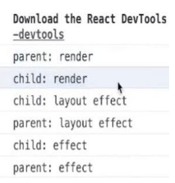
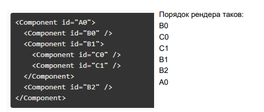
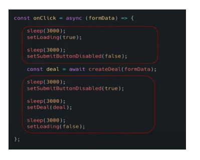
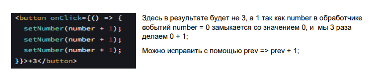
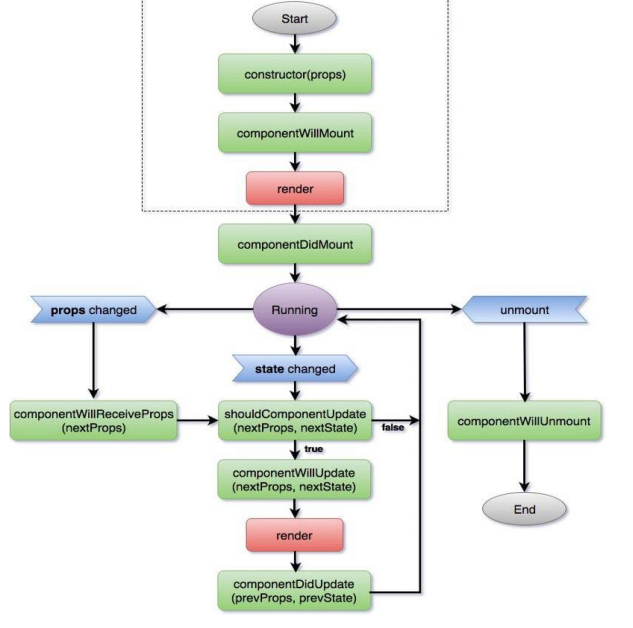
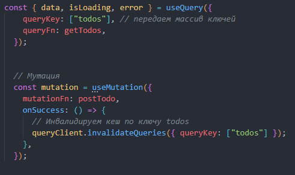

<div align="center"><h1></h1></div>

[⚙️ Back to menu](../README.md)

 <div id="menureact"></div>

| No.|             Вопрос                   |
|:---|:-------------------------------------|
|1| [Что такое React и для чего он нужен?](#react1)|
|2| [Что делает setState()](#react2)|
|3| [Что такое VirtualDom](#react3)|
|4| [Как отрисовать массив элементов](#react4)|
|5| [Разница между контролируемыми и неконтролируемыми компонентами](#react5)|
|6| [Методы жизненного цикла компонента](#react6)|
|7| [Какие React хуки вы знаете и используете](#react7)|
|8| [useState особенности использования](#react8)|
|9| [useEffect особенности использования](#react9)|
|10| [Как отследить демонтирование функционального компонента?](#react10)|
|11| [Что такое State менеджер и какой вы используете?](#react11)|
|12| [что такое `Redux` и FLUX паттерн](#react12)|
|13| [`Redux` Что такое редьюсер и какие параметры он принимает?](#react13)|
|14| [`Redux` Что такое экшн и как изменить состояние?](#react14)|
|15| [Что такое JSX?](#react15)|
|16| [Что такое PROPS?](#react16)|
|17| [Отличие в записях](#react17)|
|18| [useMemo для чего нужен и когда использовать?](#react18)|
|19| [useCallback для чего нужен и когда использовать?](#react19)|
|20| [useContext для чего нужен и когда использовать?](#react20)|
|21| [useRef для чего нужен и когда использовать?](#react21)|
|22| [React.memo для чего нужен и когда использовать?](#react22)|
|23| [Расскажите о React fiber?](#react23)|
|24| [Что такое React fragment?](#react24)|
|25| [Расскажите о React Reconciliation](#react25)|
|26| [Для чего нужны ключи key в списках?](#react26)|
|27| [Асинхронные actions в redux с помощью thunk](#react27)|
|28| [Как отрисовать блок по условию?](#react28)|
|29| [Как отследить изменение поля объекта в функциональном компоненте?](#react29)|
|30| [Как получить доступ к дом элементу в React.](#react30)|
|31| [Как работает проп children?](#react31)|
|32| [Что такое Компонент высшего порядка (Higher-Order Component, HOC)?](#react32)|
|33| [Что такое порталы (Portal) в React?](#react33)|
|34| [Flux-архитектура, Redux и MobX: Что такое Flux - архитектура? Какие сущности она имеет?](#react34) |
|35| [Чем React Native отличается от ReactJS?](#react35)|
|36|[Отладка приложений React](#react36)|
|37|[Когда вам использовать Class Component вместо Functional Component?](#react37)|
|38|[В чем разница между классовыми компонентами и функциональными?](#react38)|
|39|[Что такое строгий режим и зачем он нужен?](#react39)|
|40|[отличие компонента и элемента в Реакте](#react40)|
|41|[В каких случаях можно использовать локальное состояние, а в каких лучше использовать глобальный State?](#react41)|
|42|[Что такое store в redux](#react42)|
|43|[Что такое action в redux](#react43)|
|44|[Что такое reducer в redux](#react44)|
|45|[Что такое dispatch в redux](#react45)|
|46|[Как работает useState, зачем нужен](#react46)|
|47|[Как работает useEffect, зачем нужен](#react47)|
|48|[Как работает useLayoutEffect, зачем нужен, отличия от useEffect](#react48)|
|49|[Что такое контекст в реакт, хук useContext](#react49)|
|50|[Как работает useMemo, зачем нужен](#react50)|
|51|[Как работает useCallback, зачем нужен](#react51)|
|52|[В каких случаях нужно использовать мемоизацию и зачем](#react52)|
|53|[Как работает useReducer, зачем нужен](#react53)|
|54|[Что такое JSX](#react54)|
|55|[Next.js, CSR, SSR, ISR, SSG методы getServerSideProps, getStaticPaths, в чем преимущества SSR, когда стоит юзать](#react55)|
|56|[rtk query, инвалидация кеша](#react56)|
|57|[Какие хуки появились React 18, useId, useTransition и тд.](#react57)|
|58|[Что такое контролируемые и неконтролируемые компоненты](#react58)|
|59|[Что такое React memo и зачем нужен](#react59)|
|60|[Декларативность и императивность](#react60)|
|61|[React преимущества и недостатки](#react61)|
|62|[Что такое React lazy и Suspense](#react62)|
|63|[Порядок рендера компонентов, и вызова хуков](#react63)|
|64|[Правила вызова хуков](#react64)|
|65|[Что такое батчинг, его плюсы](#react65)|
|66|[Зачем нужен хок forwardRef](#react66)|
|67|[Хук useImperativeHandle](#react67)|
|68|[Error boundaries что такое](#react68)|
|69|[Жизненный цикл компонента и методы ЖЦ в классах, порядок вызова](#react69)|
|70|[Почему ушли от классов к функциям в реакте](#react70)|
|71|[Причины перерисовки в реакт](#react71)|
|72|[Redux vs Context плюсы и минусы](#react72)|
|73|[Что такое Виртуализация и зачем нужна](#react73)|
|74|[Кастомные хуки](#react74)|
|75|[React-query, Кеширование, инвалидация](#react75)|
|76|[Что такое - Throttling](#react76)|
|77|[Что такое - Debounce](#react77)|
 


---

<div  id="react1"></div>

## 1. Что такое React и для чего он нужен?

React — это JavaScript-библиотека, разработанная Facebook, которая используется для создания пользовательских интерфейсов, основанных на компонентах. Она позволяет разработчикам создавать большие веб-приложения, которые могут обновляться и отображаться в реальном времени без перезагрузки страницы. React облегчает создание интерактивных пользовательских интерфейсов и предлагает эффективное и гибкое решение для разработки веб- и мобильных приложений.

Вот некоторые особенности и преимущества React:

1.  **Компонентный подход**: React использует компонентную архитектуру, что позволяет создавать большие веб-приложения, которые могут изменять данные, без перезагрузки страницы. Основная идея в том, что приложение состоит из множества изолированных компонентов, которые управляют своим собственным состоянием и рендерингом, и можно легко повторно использовать и комбинировать их.

2.  **Виртуальный DOM (VDOM)**: React использует концепцию виртуального DOM, что позволяет ему быть быстрым. React создает копию DOM в памяти, и когда происходит изменение состояния, React сначала обновляет виртуальный DOM, затем сравнивает его с текущим DOM и наконец обновляет только те части реального DOM, которые были изменены. Это обеспечивает большую производительность и эффективность.

3.  **Однонаправленный поток данных**: React следует принципу "однонаправленного потока данных" или "однонаправленного связывания данных", что делает поток данных в приложении более предсказуемым и понятным.

4.  **Совместимость с другими технологиями**: React можно использовать вместе с другими библиотеками или фреймворками, такими как Angular, jQuery и т. д., что делает его универсальным решением.

5.  **Использование JSX**: JSX — это синтаксис, похожий на HTML, который облегчает написание кода компонентов React. Он преобразуется в JavaScript и предоставляет возможность вставки кода JavaScript прямо в разметку.

6.  **Поддержка сообщества и инструменты**: React имеет большое активное сообщество, обилие документации, обучающих материалов и открытых исходных кодов. Включая такие библиотеки, как Redux и React Router, которые являются стандартом для управления состоянием и маршрутизации в React-приложениях

[Оглавление - React 🔼](#menureact)


<div  id="react2"></div>


## 2 Что делает setState()

**Подробнее -** [setState](https://ru.reactjs.org/docs/faq-state.html)

Состояние хранит в себе какие-то данные, и чтобы изменить эти данные необходимо вызвать функцию setState().

Метод setState() следит за изменением состояния (state) компонента. state — это объект. Когда состояние меняется, компонент рендерится повторно и мы видим в браузере компонент с обновленными данными.

Важно отметить, что `setState()` является асинхронной функцией. Это означает, что обновления состояния не происходят мгновенно.


[Оглавление - React 🔼](#menureact)


<div  id="react3"></div>


## 3. Что такое VirtualDom?

**Подробнее -** [Virtual DOM](https://ru.reactjs.org/docs/faq-internals.html)

VirtualDOM это копия DOM дерева и вместо того, чтобы взаимодействовать с DOM напрямую, мы работаем с его легковесной копией. Мы можем вносить изменения в копию, исходя из наших потребностей, а после этого React применяет изменения к реальному DOM.

При этом происходит сравнение DOM-дерева с его виртуальной копией, определяется разница и запускается перерисовка того, что было изменено.

Такой подход работает быстрее, потому как не включает в себя все тяжеловесные части реального DOM.

[Оглавление - React 🔼](#menureact)


<div  id="react4"></div>


## 4. Как отрисовать массив элементов

  **Подробнее -** [Списки и ключи](https://ru.reactjs.org/docs/lists-and-keys.html)

Для того чтобы отрисовать список элементов используется функция массивов map, внутри которой мы пишем jsx разметку, при этом React требует указывать ключ key для каждого элемента итерации. Ключи помогают React идентифицировать, какие элементы были изменены, добавлены или удалены.

Ключи должны быть заданы элементам внутри массива, чтобы предоставить элементам постоянный идентификатор

пример:
```jsx
const numbers = [1, 2, 3, 4, 5];

return (
  <ul>
    {numbers.map((el, index) =>
      <li key={index}>{el}</li>
    )}
  </ul>
);
```
В этом коде для каждого числа из массива `numbers` создается элемент списка `<li>`.
В примере выше используется `index` массива в качестве `key`, однако это может привести к проблемам с производительностью и состоянием компонента при изменении порядка или количества элементов. В идеале `key` должен быть уникальным и стабильным идентификатором, таким как ID из базы данных.

[Оглавление - React 🔼](#menureact)


<div  id="react5"></div>


## 5. Разница между контролируемыми и неконтролируемыми компонентами

**Подробнее -** [Управляемые компоненты](https://ru.react.js.org/docs/forms.html)
**Подробнее -** [Неуправляемые компоненты](https://ru.reactjs.org/docs/uncontrolled-components.html)

Контролируемые и неконтролируемые компоненты в React относятся к формам и способу управления вводом данных пользователя.

**Контролируемые компоненты**

Контролируемые компоненты обрабатывают информацию формы через состояние в React. Вместо того чтобы читать значения из DOM, вы читаете и устанавливаете значения через состояние компонента.

Пример контролируемого компонента:
```jsx
import React, { useState } from "react";

function ControlledForm() {
  const [value, setValue] = useState("");

  const handleSubmit = (event) => {
    alert('A name was submitted: ' + value);
    event.preventDefault();
  }

  return (
    <form onSubmit={handleSubmit}>
      <label>
        Name:
        <input type="text" value={value} onChange={e => setValue(e.target.value)} />
      </label>
      <input type="submit" value="Submit" />
    </form>
  );
}
```

**Неконтролируемые компоненты**

Неконтролируемые компоненты обрабатывают информацию формы напрямую через DOM, используя Refs для доступа к элементам формы.

Пример неконтролируемого компонента:
```jsx
import React, { useRef } from "react";

function UncontrolledForm() {
  const input = useRef();

  const handleSubmit = (event) => {
    alert('A name was submitted: ' + input.current.value);
    event.preventDefault();
  }

  return (
    <form onSubmit={handleSubmit}>
      <label>
        Name:
        <input type="text" ref={input} />
      </label>
      <input type="submit" value="Submit" />
    </form>
  );
}
```
В первом примере мы используем хук `useState` для управления значением ввода, а во втором примере мы используем хук `useRef` для создания ссылки на ввод, который затем мы читаем при отправке формы.

[Оглавление - React 🔼](#menureact)


<div  id="react6"></div>


## 6. Методы жизненного цикла компонента

**Подробнее -** [Жизненный цикл](https://ru.react.js.org/docs/react-component.html)

  Существует четыре различных этапа жизненного цикла компонента React:

1. **Инициализация**: На этом этапе компонент React готовит установку начального состояния и параметров по умолчанию.

2. **Монтирование (Mounting)**: Компонент React готов для монтирования в DOM браузера. Этот этап охватывает методы жизненного цикла componentWillMount и componentDidMount.

3. **Обновление (Updating)**: На этом этапе компонент обновляется двумя способами, отправляя новые свойства и обновляя состояние. Этот этап охватывает методы жизненного цикла shouldComponentUpdate, componentWillUpdate и componentDidUpdate.

4. **Размонтирование (Unmounting)**: На этом последнем этапе компонент не нужен и отключается из DOM браузера. Этот этап включает метод жизненного цикла componentWillUnmount.

[Оглавление - React 🔼](#menureact)


<div  id="react7"></div>


## 7. Что такое хуки в React? Какие React хуки вы знаете и используете

  **Подробнее -** [Краткий обзор хуков](https://ru.reactjs.org/docs/hooks-overview.html)

[Оглавление - React 🔼](#menureact)

  Здесь лучше рассказать то, какие хуки вы используете на своей практике. Хук — это специальная функция, которая позволяет «подцепиться» к возможностям React. Например, хук useState предоставляет функциональным компонентам доступ к состоянию React. Основные React хуки:


Хуки React - это функции, которые позволяют вам "подключаться" к функциональности жизненного цикла React и состояния из функциональных компонентов. Вот некоторые из наиболее распространенных хуков React, которые вы можете использовать:

1. **useState()**: Этот хук позволяет вам добавить состояние в функциональный компонент. Он возвращает массив из двух элементов: текущее значение состояния и функцию для его обновления.

   Пример использования:
   ```javascript
   const [count, setCount] = useState(0);
   ```

2. **useEffect()**: Этот хук позволяет вам выполнять побочные эффекты в функциональном компоненте. Он может использоваться для различных задач, таких как выполнение запросов к API, работы с подписками и т. д.

   Пример использования:
   ```javascript
   useEffect(() => {
      document.title = `Вы нажали ${count} раз`;
   });
   ```

3. **useContext()**: Этот хук позволяет вам использовать контекст без оборачивания компонента в `Context.Consumer`.

   Пример использования:
   ```javascript
   const theme = useContext(ThemeContext);
   ```

4. **useReducer()**: Этот хук представляет собой альтернативу `useState` для более сложных состояний. Он позволяет вам управлять состоянием через функцию редуктора.

   Пример использования:
   ```javascript
   const [state, dispatch] = useReducer(reducer, initialArg, init);
   ```

5. **useRef()**: Этот хук позволяет вам создать ссылку на элемент.

   Пример использования:
   ```javascript
   const myRef = useRef(null);
   ```

6. **useCallback()**: Этот хук возвращает мемоизированный колбэк.

   Пример использования:
   ```javascript
   const memoizedCallback = useCallback(() => {
      doSomething(a, b);
   }, [a, b]);
   ```

7. **useMemo()**: Этот хук возвращает мемоизированное значение.

   Пример использования:
   ```javascript
   const memoizedValue = useMemo(() => computeExpensiveValue(a, b), [a, b]);
   ```

<div  id="react8"></div>


## 8. useState особенности использования

  **Подробнее -** [useState](https://ru.reactjs.org/docs/hooks-state.html)

UseState - Возвращает значение с состоянием и функцию для его обновления.

Во время первоначального рендеринга возвращаемое состояние (state) совпадает со значением, переданным в качестве первого аргумента (initialState).

Функция setState используется для обновления состояния. Она принимает новое значение состояния и ставит в очередь повторный рендер компонента. Функция setState может принимать параметром, как и новое значение, так и функцию callback, которая параметром принимает предыдущее значение.

[Оглавление - React 🔼](#menureact)


<div  id="react9"></div>

## 9. useEffect особенности использования

**Подробнее -** [useEffect](https://ru.reactjs.org/docs/hooks-effect.html)

`useEffect` - это хук в React, который позволяет выполнять побочные эффекты в функциональных компонентах. Он может быть использован для различных целей, таких как получение данных, подписка на события или изменение DOM напрямую.

Вот некоторые ключевые особенности использования `useEffect`:

1. **Вызов функции внутри `useEffect`**: функция, которую вы передаете в `useEffect`, будет вызываться после того, как браузер отрисует и обновит DOM. Все побочные эффекты должны быть выполнены внутри этой функции.

   ```jsx
   useEffect(() => {
     document.title = `You clicked ${count} times`;
   });
   ```

2. **Зависимости эффекта**: второй аргумент `useEffect` - это массив зависимостей. Эффект будет запущен заново только если одна из его зависимостей изменилась между рендерами. Если вы передадите пустой массив, эффект выполнится только один раз после первого рендеринга.

   ```jsx
   useEffect(() => {
     fetchData(id);
   }, [id]); // fetchData will be called again if 'id' changes
   ```

3. **Очистка эффекта**: функция, которую вы передаете в `useEffect`, может возвращать другую функцию. Эта возвращенная функция будет вызываться перед тем, как компонент будет удален из DOM или перед следующим вызовом эффекта. Это можно использовать для очистки, например, отмены подписок или таймеров.

   ```jsx
   useEffect(() => {
     const timerID = setInterval(() => {
       tick();
     }, 1000);
     return function cleanup() {
       clearInterval(timerID);
     };
   });
   ```

4. **Пропуск эффекта при обновлении**: если вы не передаете второй аргумент, эффект будет выполнен после каждого обновления. Используйте это с осторожностью, так как это может привести к бесконечному циклу, если вы обновляете состояние внутри эффекта.

   ```jsx
   useEffect(() => {
     setCount(count + 1); // this will cause an infinite loop
   });
   ```

В общем, `useEffect` позволяет выполнять побочные эффекты в функциональных компонентах и контролировать, когда эти эффекты должны выполняться и очищаться.

[Оглавление - React 🔼](#menureact)


<div  id="react10"></div>


## 10. Как отследить демонтирование функционального компонента?

**Подробнее -** [useEffect со сбросом](https://ru.reactjs.org/docs/hooks-effect.html%23effects-with-cleanup)

Часто эффекты создают ресурсы, которые необходимо очистить (или сбросить) перед тем, как компонент покидает экран, например, подписку или идентификатор таймера. Чтобы сделать это, функция, переданная в useEffect, может вернуть функцию очистки. Функция очистки запускается до удаления компонента из пользовательского интерфейса, чтобы предотвратить утечки памяти. Кроме того, если компонент рендерится несколько раз (как обычно происходит), предыдущий эффект очищается перед выполнением следующего эффекта.

```jsx
useEffect(() => {
  // Действия, которые выполняются при монтировании компонента
  const timerID = setInterval(() => {
    console.log('Таймер работает');
  }, 1000);

  // Функция очистки, которая выполняется при демонтировании компонента
  return () => {
    clearInterval(timerID);
    console.log('Компонент был демонтирован');
  };
}, []); // Пустой массив зависимостей означает, что эффект запускается только при монтировании и очищается при демонтировании
```

[Оглавление - React 🔼](#menureact)


<div  id="react11"></div>


## 11. Что такое State менеджер и какой вы используете?

State менеджер решает несколько проблем, во первых это хорошая практика, отделять данные и логику по работе с ними от компонентов, во вторых, если использовать локальное состояние и передавать его из компоненты в компонент код становится запутанным, поскольку вложенность компонентов может быть большой. Имея глобальное хранилище, мы можем обращаться к нему с любого компонента и получать\изменять данные. Вместе с React используют чаще всего либо Redux, либо MobX.

[Оглавление - React 🔼](#menureact)


<div  id="react12"></div>


## 12. что такое `Redux` и FLUX паттерн

`Redux` - это стейт менеджер для хранения состояния приложения, основанный на паттерне проектирования Flux. принципы Redux: единственный источник истины (store). Состояние только для чтения (единственный способ обновить состояние – action). Изменения вносятся с помощью чистых функций (reducers)

[Оглавление - React 🔼](#menureact)


<div  id="react13"></div>


## 13. Redux. Что такое редьюсер и какие параметры он принимает?

**Подробнее -** [reducers](https://redux.js.org/tutorials/fundamentals/part-3-state-actions-reducers%23writing-reducers)

В Redux, **редьюсер** - это чистая функция, которая принимает текущее состояние приложения (state) и действие (action), а затем возвращает новое состояние. Редьюсеры являются ключевым механизмом в Redux, и именно они отвечают за обновление состояния.

Редьюсер принимает два параметра:

1. **state**: Текущее состояние приложения или часть состояния, которую редьюсер контролирует. Важно отметить, что редьюсер никогда не изменяет этого состояния напрямую. Вместо этого, он создает и возвращает новое состояние на основе входящего состояния и действия.

2. **action**: Объект действия, который описывает, что произошло. Объект действия должен содержать поле `type`, которое указывает на тип произошедшего действия. Он также может содержать дополнительные данные в поле `payload` или других полях, которые затем могут быть использованы редьюсером для обновления состояния.

Пример редьюсера в Redux:

```javascript
function counterReducer(state = 0, action) {
  switch (action.type) {
    case 'INCREMENT':
      return state + 1;
    case 'DECREMENT':
      return state - 1;
    default:
      return state;
  }
}
```

В этом примере, в зависимости от типа действия (`INCREMENT` или `DECREMENT`), редьюсер обновляет состояние, увеличивая или уменьшая его на единицу. Если тип действия не известен, редьюсер просто возвращает текущее состояние без изменений.


[Оглавление - React 🔼](#menureact)


<div  id="react14"></div>


## 14. Redux. Что такое экшн и как изменить состояние?

**Подробнее -** [actions](https://redux.js.org/faq/actions%23actions)

  В Redux **экшен (action)** - это обычный JavaScript объект, который описывает произошедшее событие или изменение. Экшен - единственный способ передать данные из приложения в хранилище Redux.

У каждого экшена должно быть свойство `type`, которое указывает на тип произошедшего действия. Это обычно строка и важна для того, чтобы редьюсер мог определить, каким образом изменить состояние в ответ на этот экшен. Экшены могут также содержать дополнительные данные в поле `payload` или других полях.

Пример объекта экшена:

```javascript
{
  type: 'ADD_TODO',
  payload: {
    id: 1,
    text: 'Learn Redux'
  }
}
```

Чтобы изменить состояние с помощью экшена, нужно сначала **отправить** (dispatch) этот экшен. Отправка экшена осуществляется с помощью функции `dispatch()`, которую предоставляет Redux. После отправки экшена, он проходит через все редьюсеры в хранилище Redux. Каждый редьюсер проверяет тип экшена и решает, нужно ли обновить свое состояние в ответ на этот экшен.

Вот пример того, как можно отправить экшен и изменить состояние:

```javascript
// создание экшена
let action = {
  type: 'ADD_TODO',
  payload: {
    id: 1,
    text: 'Learn Redux'
  }
};

// отправка экшена
dispatch(action);
```

Этот код создает экшен с типом `ADD_TODO` и отправляет его с помощью функции `dispatch()`. После этого редьюсеры в хранилище Redux реагируют на этот экшен и обновляют состояние соответствующим образом.

[Оглавление - React 🔼](#menureact)


<div  id="react15"></div>


## 15. Что такое JSX?

  **Подробнее -** [jsx](https://ru.react.js.org/docs/introducing-jsx.html)

По умолчанию чтобы создавать элементы в реакт используется такой синтаксис

```js
const element = React.createElement(
	'h1',
	{className: 'greeting'},
	'Привет, мир!'
);
```
Но мы привыкли видеть его вот таким
```jsx
const element = (
	<h1 className='greeting'>
		Hello, World!
	</h1>;
);
```
именно такая разметка и называется jsx. Это некое расширение языка упрощающее восприятие кода и разработку.

[Оглавление - React 🔼](#menureact)


<div  id="react16"></div>


## 16. Что такое PROPS?

**Подробнее -** [props](https://reactjs.org/docs/components-and-props.html)

**Props** (от англ. "properties", "свойства") – данные, которые передаются в компонент из родительского. **Props** доступны только для чтения и не могут быть изменены.

пример:
```jsx
function WelcomeMessage(props) {
  return <h1>Hello, {props.name}!</h1>;
}

function App() {
  return <WelcomeMessage name="Alice" />;
}
```

[Оглавление - React 🔼](#menureact)


<div  id="react17"></div>


## 17. Отличие в записях SetState

  В функциональных компонентах React с использованием хуков `setState` заменяется на `useState`, который возвращает пару значений: текущее состояние и функцию для его обновления.

1. **Обновление состояния напрямую**

    Вы можете просто передать новое значение в функцию обновления состояния, которое заменит текущее состояние.

    ```jsx
    const [count, setCount] = useState(0);
    setCount(5);
    ```

    В этом случае `count` будет равен 5, независимо от его предыдущего значения.

2. **Обновление состояния на основе предыдущего состояния**

    Если новое состояние зависит от предыдущего состояния, вы можете передать функцию в функцию обновления состояния. Эта функция принимает предыдущее состояние и возвращает новое состояние.

    ```jsx
    const [count, setCount] = useState(0);
    setCount(prevCount => prevCount + 1);
    ```

    В этом случае `count` будет увеличен на 1 относительно его предыдущего значения. Этот подход гарантирует, что вы работаете с самым последним состоянием, даже если обновления состояния происходят асинхронно.


[Оглавление - React 🔼](#menureact)


<div  id="react18"></div>


## 18. useMemo для чего нужен и когда использовать?

**Подробнее -** [useMemo](https://ru.reactjs.org/docs/hooks-reference.html%23usememo)

`useMemo` - это React хук, который используется для мемоизации сложных функций, то есть для сохранения результатов функции, чтобы избежать повторного её выполнения при следующих рендерах, если входные данные не изменились.

`useMemo` принимает два аргумента:
1. Функция, результат которой мы хотим мемоизировать.
2. Массив зависимостей, по которому React определит, нужно ли заново выполнять функцию или же можно использовать сохраненный результат.

Пример использования `useMemo`:
```jsx
const expensiveCalculation = useMemo(() => {
    return performExpensiveCalculation(a, b);
}, [a, b]);
```
В этом примере `performExpensiveCalculation` будет вызываться только тогда, когда изменяются значения `a` или `b`. В противном случае React будет использовать сохраненный результат, что позволит увеличить производительность приложения.

`useMemo` следует использовать, когда:
- Вы работаете с большими массивами или объектами и хотите избежать лишних рендеров и пересчетов.
- Вы выполняете сложные вычисления, которые занимают много времени.
- Вы передаете коллекции в компоненты и хотите предотвратить ненужные ререндеры из-за того, что новый объект создается при каждом рендере.

Однако следует помнить, что `useMemo` не всегда приводит к улучшению производительности. Иногда затраты на мемоизацию (хранение предыдущих результатов и сравнение аргументов) могут быть больше, чем преимущества от ее использования. Поэтому его следует использовать осознанно.

[Оглавление - React 🔼](#menureact)


<div  id="react19"></div>

## 19. useCallback для чего нужен и когда использовать?

**Подробнее -** [useCallback](https://ru.reactjs.org/docs/hooks-reference.html%23usecallback)

Хук `useCallback` в React используется для мемоизации функций с целью оптимизации производительности.

`useCallback` принимает два аргумента:
1. Функция, которую мы хотим мемоизировать.
2. Массив зависимостей, на основе которых React определяет, когда нужно пересоздавать функцию.

Когда массив зависимостей остается неизменным, React возвращает сохраненную версию функции, что предотвращает её ненужное пересоздание.

Пример использования `useCallback`:

```jsx
const memoizedCallback = useCallback(() => {
    doSomething(a, b);
}, [a, b]);
```

В этом примере функция `doSomething(a, b)` будет пересоздана только в случае, если `a` или `b` изменятся.

`useCallback` стоит использовать в следующих случаях:

1. Когда вы передаете функцию в оптимизированный дочерний компонент, который полагается на сравнение ссылок для предотвращения ненужных рендеров (например, компонент, обернутый в `React.memo`).
2. Когда вы передаете функцию в хук, который принимает функцию и массив зависимостей, как, например, `useEffect`, `useCallback` или `useMemo`.
3. Когда вы используете функцию в большом компоненте, и эта функция пересоздается при каждом рендере.

Однако стоит отметить, что ненужное использование `useCallback` может привести к ухудшению производительности, поскольку создание мемоизированной функции также требует ресурсов. Поэтому `useCallback` следует использовать только тогда, когда это действительно необходимо.

[Оглавление - React 🔼](#menureact)


<div  id="react20"></div>


## 20. useContext для чего нужен и когда использовать?

**Подробнее -** [useContext](https://ru.reactjs.org/docs/hooks-reference.html%23usecontext)

Хук `useContext` в React используется для доступа к значению контекста. Context в React позволяет передавать данные через дерево компонентов без необходимости передавать их через пропсы на каждом уровне.

В основном, это полезно в случаях, когда некоторые данные должны быть доступны для большого количества компонентов в разных уровнях дерева компонентов. Примером может служить тема оформления, текущий выбранный язык, данные пользователя и т.д.

Пример использования `useContext`:

```jsx
// Создание контекста
const ThemeContext = React.createContext('light');

function ThemedButton() {
  // Использование хука useContext для доступа к значению контекста
  const theme = useContext(ThemeContext);
  return <Button theme={theme} />;
}

// Компонент App, который использует ThemedButton
function App() {
  return (
    <ThemeContext.Provider value="dark">
      <ThemedButton />
    </ThemeContext.Provider>
  );
}
```

В этом примере `ThemedButton` может получить текущую тему без необходимости получать её через пропсы от `App`.

Используйте `useContext` тогда, когда вам нужно сделать некоторые данные доступными для большого количества компонентов на различных уровнях в дереве компонентов. Это может упростить ваш код и сделать его более чистым, избегая "проп-дрелинга" (передачи данных через пропсы на каждом уровне).

[Оглавление - React 🔼](#menureact)


<div  id="react21"></div>


## 21. useRef для чего нужен и когда использовать?

  **Подробнее -** [useRef](https://ru.reactjs.org/docs/hooks-reference.html%23useref)

[Оглавление - React 🔼](#menureact)

  Хук `useRef` в React используется для создания ссылок на элементы.

В отличие от состояния, изменения `ref` не вызывают повторный рендеринг компонента. Это делает `ref` удобными для сохранения значений, которые могут изменяться во время жизненного цикла компонента, но не вызывают повторный рендеринг.

`useRef` часто используется для доступа к DOM-элементам и их методам. Например, вы можете использовать `ref`, чтобы установить фокус на определенном поле ввода.

```jsx
import React, { useRef } from 'react';

function TextInputWithFocusButton() {
  const inputEl = useRef(null);
  const onButtonClick = () => {
    // `current` указывает на подключенный текстовый ввод
    inputEl.current.focus();
  };
  return (
    <>
      <input ref={inputEl} type="text" />
      <button onClick={onButtonClick}>Установить фокус на поле ввода</button>
    </>
  );
}

export default TextInputWithFocusButton;
```

`useRef` также можно использовать для хранения любых изменяемых значений, аналогичных instance variables в классовых компонентах. Например, для отслеживания предыдущего состояния или пропсов.

Используйте `useRef`, когда вам нужно получить прямой доступ к DOM-элементу (например, для установки фокуса или измерения элемента) или когда вам нужно сохранить изменяемое значение, которое не вызывает перерендеринг.

<div  id="react22"></div>


## 22. React.memo для чего нужен и когда использовать?

  **Подробнее -** [memo](https://ru.reactjs.org/docs/react-api.html%23reactmemo)

[Оглавление - React 🔼](#menureact)

  `React.memo` — это функция высшего порядка, которая позволяет обернуть компонент и предотвратить его повторный рендеринг, если пропсы не изменились. Это похоже на `PureComponent` для классовых компонентов, но для функциональных.

`React.memo` делает поверхностное сравнение пропсов. Если пропсы не изменились, он пропускает рендеринг компонента и повторно использует последний результат.

Пример использования `React.memo`:

```jsx
const MyComponent = React.memo(function MyComponent(props) {
  /* рендеринг используя пропсы */
});
```

Используйте `React.memo` тогда, когда у вас есть функциональный компонент, который часто перерендеривается с теми же пропсами. `React.memo` может помочь улучшить производительность, предотвращая ненужные рендеринги. Однако стоит помнить, что использование `React.memo` также имеет свою цену — выполнение поверхностного сравнения пропсов. Это значит, что его использование может быть полезно не во всех случаях, и лучше использовать `React.memo` осознанно, когда вы столкнулись с проблемами производительности, которые он может помочь решить.

<div  id="react23"></div>


## 23. Расскажите о React fiber?

**Подробнее -** [react fiber](https://ru.reactjs.org/docs/faq-internals.html)

  React Fiber — это переписанная с нуля архитектура React, которая была представлена в React 16. Она была разработана для поддержки некоторых важных функций, таких как:

- **Асинхронная рендеризация**: это позволяет React обрабатывать обновления приоритетов (например, анимации и взаимодействия, которые должны быть более гладкими и реагировать быстрее, чем обновления, производимые в фоновом режиме).

- **Обработка ошибок**: React Fiber вводит границы ошибок (error boundaries), которые позволяют вам обрабатывать ошибки в одной части дерева компонентов без ломки всего приложения.

- **Прерываемость/возобновляемость**: это дает больше контроля над механизмом рендеринга, позволяя React остановить рендеринг, а затем продолжить его позже.

- **Обратная совместимость**: важным аспектом является то, что Fiber полностью обратно совместим с предыдущими версиями.

React Fiber использует концепцию фибр — структур, которые представляют собой единицы работы, которые должны быть выполнены. Это позволяет React управлять процессом рендеринга и делать его более гибким и эффективным.

Важно отметить, что Fiber — это внутренняя реализация React, и большинству разработчиков не нужно знать детали его работы для повседневной разработки. Однако понимание концепций, стоящих за Fiber, может быть полезным для глубокого понимания React и того, как он работает.

[Оглавление - React 🔼](#menureact)


<div  id="react24"></div>


## 24. Что такое React fragment?

  **Подробнее -** [fragment](https://ru.reactjs.org/docs/fragments.html)

React.Fragment - это компонент в React, который позволяет возвращать несколько элементов из компонента без необходимости оборачивать их в дополнительный родительский элемент (например, `<div>`).

Пример использования:

```jsx
render() {
  return (
    <React.Fragment>
      <ChildA />
      <ChildB />
      <ChildC />
    </React.Fragment>
  );
}
```

Или короткая форма:

```jsx
render() {
  return (
    <>
      <ChildA />
      <ChildB />
      <ChildC />
    </>
  );
}
```

Это полезно, когда вы не хотите добавлять лишний уровень вложенности в DOM дерево вашего приложения. Он также помогает избегать потенциальных стилевых проблем, которые могут возникнуть при использовании `<div>` или других тегов для группировки дочерних элементов.

[Оглавление - React 🔼](#menureact)


<div  id="react25"></div>


## 25. Расскажите о React Reconciliation

**Подробнее -** [Согласование](https://ru.reactjs.org/docs/reconciliation.html%23gatsby-focus-wrapper)

  Процесс согласования (Reconciliation) в React — это алгоритм, который использует React для эффективного обновления DOM. Это процесс, используемый React, чтобы установить, какие части дерева компонентов были изменены и как эти изменения должны быть отражены в DOM.

Основной принцип работы алгоритма согласования включает в себя следующие шаги:

1. **Когда данные в компоненте изменяются (через setState, например), React обновляет этот компонент и его дочерние компоненты.**

2. **React создает новое дерево из компонентов и сравнивает его с предыдущим деревом.**

3. **React затем обновляет DOM, чтобы отразить любые изменения, найденные в процессе сравнения этих двух деревьев.**

Существуют определенные эвристики, которые React использует для ускорения этого процесса:

- Два элемента разных типов порождат разные деревья.
- Разработчик может подсказать React, что элементы могут быть стабильными между разными рендерами с помощью ключа (key prop).

Этот процесс позволяет React быть очень эффективным при обновлении DOM и поддерживать высокую производительность, даже когда рендерятся большие и сложные иерархии компонентов.

[Оглавление - React 🔼](#menureact)


<div  id="react26"></div>


## 26. Для чего нужны ключи key в списках?

  **Подробнее -** [Ключи](https://ru.reactjs.org/docs/lists-and-keys.html%23keys)

Key - это атрибут, который нужно использовать при создании списков из элементов массива. 

Проп key помогает React определять, какие элементы массива подверглись изменениям, были добавлены или удалены. 

Он должен быть уникальным, их необходимо указывать, чтобы React мог сопоставлять элементы массива с течением времени, по дефолту будут использоваться index. 

Использовать индексы в качестве ключей не рекомендуется, если порядок расположения элементов может измениться, потому что это может повлечь за собой неожиданное поведение состояний. 

При изменении ключа компонент демонтируется и монтируется заново.

**Что будет если в качестве key использовать индекс массива?**

Если удалить или добавить что-то по середине или отсортировать. key останется точно таким же, что и прежде, и React предполагает, что DOM-элемент отображает тот же компонент, что и прежде. Но это уже не так.

[Оглавление - React 🔼](#menureact)


<div  id="react27"></div>


## 27. Асинхронные actions в redux с помощью thunk

  **Подробнее -** [redux thunk](https://habr.com/ru/post/483314/)

[Оглавление - React 🔼](#menureact)

  В Redux среда выполнения `middleware` обрабатывает более сложную асинхронную логику. Один из наиболее распространенных middleware для Redux - это `redux-thunk`, который позволяет создавать асинхронные actions.

Обычные действия в Redux - это объекты, которые синхронно отправляются в хранилище с помощью `dispatch()`. Однако, когда вы используете `redux-thunk`, ваши actions могут стать функциями, что позволяет их вызывать асинхронно.

Вот базовый пример асинхронного action, который использует `redux-thunk`:

```javascript
// action types
const FETCH_DATA_REQUEST = 'FETCH_DATA_REQUEST';
const FETCH_DATA_SUCCESS = 'FETCH_DATA_SUCCESS';
const FETCH_DATA_FAILURE = 'FETCH_DATA_FAILURE';

// action creators
const fetchDataRequest = () => ({ type: FETCH_DATA_REQUEST });
const fetchDataSuccess = data => ({ type: FETCH_DATA_SUCCESS, payload: data });
const fetchDataFailure = error => ({ type: FETCH_DATA_FAILURE, payload: error });

// thunk action creator
export const fetchData = () => {
  return function(dispatch) {
    // начинаем запрос данных, dispatch запроса
    dispatch(fetchDataRequest());

    return fetch('https://api.example.com/data')
      .then(response => response.json())
      .then(data => {
        // запрос успешно завершился, dispatch успешного получения данных
        dispatch(fetchDataSuccess(data));
      })
      .catch(error => {
        // запрос завершился с ошибкой, dispatch ошибки
        dispatch(fetchDataFailure(error));
      });
  };
};
```

В этом примере `fetchData` является асинхронным action creator. Функция `fetchData` возвращает новую функцию, которая принимает `dispatch` в качестве аргумента. Это позволяет нам использовать `dispatch` внутри асинхронной операции (в данном случае `fetch`).

Прежде чем начать запрос, мы dispatch `fetchDataRequest()`. Затем, когда данные успешно загружены, мы dispatch `fetchDataSuccess()`, передавая данные в качестве аргумента. Если в процессе возникает ошибка, мы dispatch `fetchDataFailure()`, передавая ошибку в качестве аргумента.

<div  id="react28"></div>


## 28. Как отрисовать блок по условию?

**Подробнее -** [Условный рендеринг](https://ru.reactjs.org/docs/conditional-rendering.html)

  В React можно отрисовать блок по условию с использованием условных операторов JavaScript, таких как `if`, `if-else` или тернарный оператор. Ниже приведены примеры обоих подходов.

1. Использование тернарного оператора:

```jsx
function ExampleComponent({ condition }) {
  return (
    <div>
      {condition ? <div>Это отрендерится, если condition истинно</div> : <div>Это отрендерится, если condition ложно</div>}
    </div>
  );
}
```

2. Использование логического оператора "&&":

```jsx
function ExampleComponent({ condition }) {
  return (
    <div>
      {condition && <div>Этот блок отрендерится только если condition истинно</div>}
    </div>
  );
}
```

В обоих этих примерах `condition` - это prop, который передается в компонент `ExampleComponent`. Если `condition` истинно, то будет отрендерен соответствующий блок. Если `condition` ложно, то блок не будет отрендерен.

[Оглавление - React 🔼](#menureact)


<div  id="react29"></div>


## 29. Как отследить изменение поля объекта в функциональном компоненте?

**Подробнее -** [UseEffect](https://ru.reactjs.org/docs/hooks-reference.html%23useeffect)

  Для этого необходимо воспользоваться хуком useEffect и в массив зависимостей передать поле объекта.

  ---
  В функциональных компонентах React вы можете отследить изменение поля объекта с использованием хука `useEffect`.

Хук `useEffect` принимает два аргумента: функцию-эффект, которую нужно выполнить, и массив зависимостей. Если одна из зависимостей меняется, React будет вызывать функцию-эффект.

Вот пример, в котором `useEffect` используется для отслеживания изменений поля `name` в объекте `person`:

```jsx
import React, { useState, useEffect } from 'react';

function ExampleComponent() {
  const [person, setPerson] = useState({ name: 'John', age: 30 });

  useEffect(() => {
    console.log(`Имя изменилось на ${person.name}`);
  }, [person.name]);

  const handleChangeName = () => {
    setPerson(prevPerson => ({ ...prevPerson, name: 'Jane' }));
  };

  return (
    <div>
      <p>Имя: {person.name}</p>
      <p>Возраст: {person.age}</p>
      <button onClick={handleChangeName}>Изменить имя</button>
    </div>
  );
}

export default ExampleComponent;
```

В этом примере, каждый раз, когда поле `name` в объекте `person` меняется, функция внутри `useEffect` будет вызываться, и в консоль будет выводиться новое имя.

[Оглавление - React 🔼](#menureact)


<div  id="react30"></div>


## 30. Как получить доступ к дом элементу в React.

  **Подробнее –** [refs](https://ru.reactjs.org/docs/refs-and-the-dom.html)

Для доступа к DOM-элементам в React используется хук `useRef`.

`useRef` возвращает изменяемый ref-объект, свойство `.current` которого инициализируется переданным аргументом (`initialValue`). Возвращённый объект будет сохраняться в течение всего времени жизни компонента.

Пример использования `useRef` для доступа к DOM-элементу:

```jsx
import React, { useRef } from 'react';

function ExampleComponent() {
  const inputRef = useRef(null);

  const focusInput = () => {
    // `current` указывает на смонтированный текстовый элемент `input`
    inputRef.current.focus();
  };

  return (
    <>
      <input ref={inputRef} type="text" />
      <button onClick={focusInput}>Установить фокус на поле ввода</button>
    </>
  );
}

export default ExampleComponent;
```

В этом примере, когда вы нажимаете кнопку, фокус устанавливается на текстовое поле ввода. Важно помнить, что в React вы должны использовать этот паттерн осторожно и только в тех случаях, когда не можете выполнить задачу иначе. Обычно вы должны стараться избегать прямого взаимодействия с DOM.

[Оглавление - React 🔼](#menureact)

<div  id="react31"></div>


## 31. Как работает проп children?

Проп `children` в React представляет собой специальный проп, который позволяет передавать содержимое (дочерние элементы) в компонент. Он используется для вложенных элементов и текста, которые передаются между открывающим и закрывающим тегами компонента.

Пример использования пропа `children`:

```jsx
function MyComponent({ children }) {
  return <div>{children}</div>;
}

// Использование компонента и передача содержимого в виде дочерних элементов
<MyComponent>
  <h1>Заголовок</h1>
  <p>Некоторый текст</p>
</MyComponent>
```

В приведенном выше примере компонента `MyComponent` содержимое, заключенное между тегами `<MyComponent>` и `</MyComponent>`, будет передано в компонент через проп `children`. В данном случае, дочерними элементами будут `<h1>Заголовок</h1>` и `<p>Некоторый текст</p>`. Внутри компонента `MyComponent` мы можем использовать `children` для рендеринга этого содержимого внутри других элементов или компонентов.

Проп `children` может содержать любые элементы React, включая другие компоненты, строки, числа и т. д. Это позволяет гибко использовать компоненты и передавать им содержимое внутри.

Кроме использования в качестве дочерних элементов, проп `children` также может быть использован для передачи функции-коллбэка в компоненты, которые ожидают его в качестве пропа. Это позволяет динамически взаимодействовать с содержимым компонента.

```jsx
function MyComponent({ children }) {
  return <div>{children('Привет, мир!')}</div>;
}

<MyComponent>
  {(message) => <p>{message}</p>}
</MyComponent>
```

В этом примере, `children` является функцией, которая вызывается внутри компонента `MyComponent` с аргументом `'Привет, мир!'`. Мы передаем функцию в виде дочернего элемента `<MyComponent>`, которая будет вызвана и внутри которой мы можем рендерить дополнительные элементы или выполнять другие действия на основе переданного сообщения.

[Оглавление - React 🔼](#menureact)

<div  id="react32"></div>


## 32. Что такое Компонент высшего порядка (Higher-Order Component, HOC)?

Говоря просто, компонент высшего порядка — это функция, которая принимает компонент и возвращает новый компонент. HOC часто встречаются в сторонних библиотеках, например connect в Redux и createFragmentContainer в Relay.

```js
const EnhancedComponent = higherOrderComponent(WrappedComponent);
```

Давайте реализуем функцию withSubscription — она будет создавать компоненты и подписывать их на обновления DataSource (наподобие CommentList и BlogPost). Функция будет принимать оборачиваемый компонент и через пропсы передавать ему новые данные:

```js
const CommentListWithSubscription = withSubscription(
	CommentList,
	(DataSource) => DataSource.getComments()
);

const BlogPostWithSubscription = withSubscription(
	BlogPost,
	(DataSource, props) => DataSource.getBlogPost(props.id)
);
```

Первый параметр — это оборачиваемый компонент. Второй — функция, которая извлекает нужные нам данные, она получает DataSource и текущие пропсы.

Заметьте, что HOC ничего не меняет и не наследует поведение оборачиваемого компонента, вместо этого HOC оборачивает оригинальный компонент в контейнер посредством композиции. HOC является чистой функцией без побочных эффектов. Вот и всё! Оборачиваемый компонент получает все пропсы, переданные контейнеру, а также проп data. Для HOC не важно, как будут использоваться данные, а оборачиваемому компоненту не важно, откуда они берутся.

[Оглавление - React 🔼](#menureact)

<div  id="react33"></div>

## 33. Что такое порталы в React?

Порталы позволяют рендерить дочерние элементы в DOM-узел, который находится вне DOM-иерархии родительского компонента.

```js
ReactDOM.createPortal(child, container)
```

Первый аргумент (child) — это любой React-компонент, который может быть отрендерен, такой как элемент, строка или фрагмент. Следующий аргумент (container) — это DOM-элемент.

Типовой случай применения порталов — когда в родительском компоненте заданы стили overflow: hidden или z-index, но вам нужно чтобы дочерний элемент визуально выходил за рамки своего контейнера. Например, диалоги, всплывающие карточки и всплывающие подсказки.

[Оглавление - React 🔼](#menureact)

<div  id="react34"></div>

## 34. Flux-архитектура, Redux и MobX: Что такое Flux - архитектура? Какие сущности она имеет?

Flux - это архитектурный подход или паттерн проектирования для построения пользовательских интерфейсов, разработанный в Facebook вместе с библиотекой React.

Центральная идея Flux-архитектуры - управление потоком данных в приложении в одном направлении. В отличие от двусторонней привязки данных (two-way data binding), используемой во многих других фреймворках, Flux обеспечивает однонаправленный поток данных, который делает поток данных более предсказуемым.

Вот основные сущности, которые присутствуют в архитектуре Flux:

1. **Действия (Actions)** - Это простые объекты, содержащие новые данные и тип события. Действия создаются и отправляются в диспетчер с помощью создателей действий (action creators).

2. **Диспетчер (Dispatcher)** - Центральный хаб, который управляет всеми потоками данных в приложении Flux. Каждое действие, переданное в диспетчер, распространяется на все хранилища.

3. **Хранилища (Stores)** - Компоненты, которые содержат состояние приложения и логику его изменения. В отличие от моделей в MVC-архитектуре, которые представляют объекты в вашем приложении, хранилища в Flux представляют собой больше всего состояние приложения и управляют его обновлением.

4. **Представления (Views)** - Компоненты React, которые слушают изменения в хранилищах и перерисовываются, когда состояние в хранилищах меняется. Это обеспечивает синхронизацию представлений с текущим состоянием приложения.

Пример архитектуры Flux: пользователь нажимает кнопку в представлении, что вызывает действие. Это действие передается в диспетчер, который затем отправляет действие во все хранилища. Хранилища обрабатывают действие и обновляют свое состояние, если это необходимо. Когда состояние хранилища обновляется, он генерирует событие изменения, на которое реагирует представление, обновляя себя в соответствии с новым состоянием.

Redux и MobX - это библиотеки, которые предоставляют альтернативные реализации идеи Flux. Redux сохраняет ключевые аспекты Flux, но значительно упрощает структуру, сокращая количество ключевых сущностей до трех: Store, Action и Reducer. Redux использует одно хранилище для всего состояния приложения и использует чистые функции (reducers) для обновления этого состояния.

MobX, с другой стороны, предлагает более декларативный и автоматический подход к управлению состоянием. Вместо явного определения действий и редукторов, MobX позволяет вам работать непосредственно с обновляемыми значениями, и он автоматически отслеживает, какие компоненты должны быть обновлены на основе тех данных, которые они используют.

Обе библиотеки имеют свои преимущества и отлично подходят для разных сценариев использования. Выбор между ними обычно определяется предпочтениями команды, конкретными требованиями проекта и личными предпочтениями разработчиков.

<div  id="react35"></div>

## 35. Чем React Native отличается от ReactJS?

React (или ReactJS) и React Native являются популярными JavaScript-библиотеками, разработанными Facebook. Они обе основаны на концепции компонентов и используют Virtual DOM для оптимизации рендеринга, но предназначены для разных целей.

1. **ReactJS** предназначен для построения интерфейсов веб-приложений. Он позволяет разработчикам создавать масштабируемые и быстро реагирующие веб-приложения с использованием JavaScript и концепции компонентов.

2. **React Native** предназначен для разработки нативных мобильных приложений. React Native позволяет разработчикам писать код на JavaScript, который затем компилируется в нативный код для каждой платформы (iOS или Android). Это позволяет создавать высокопроизводительные мобильные приложения, которые выглядят и ведут себя как нативные приложения, но при этом разрабатываются на JavaScript.

Основное различие между ReactJS и React Native заключается в том, что ReactJS используется для веб-разработки, в то время как React Native используется для разработки мобильных приложений. Это включает в себя различия в API для работы с DOM и устройствами, специфичными для каждой платформы, такими как камера или геолокация.

Тем не менее, навыки, приобретенные при изучении одной из этих библиотек, в большой степени применимы к другой, что делает переход от веб-разработки к мобильной (или наоборот) довольно простым для разработчиков React.

[Оглавление - React 🔼](#menureact)

<div  id="react36"></div>

## 36. Как вы отлаживаете приложения React и какие инструменты можете использовать?

Отладка приложений React - важная часть процесса разработки. Есть несколько инструментов и методов, которые можно использовать:

1. **React Developer Tools**: Это расширение для браузера, которое можно установить в Google Chrome, Firefox и других. Оно позволяет вам исследовать дерево компонентов React, их свойства, состояние и так далее.

2. **Консоль браузера**: Вы можете использовать `console.log`, `console.error` или `console.warn` для вывода информации прямо в консоль браузера. Ошибки компиляции и исключения также появляются здесь.

3. **Отладчик JavaScript в браузере**: Большинство современных браузеров имеют встроенные инструменты разработчика с отладчиком JavaScript, который позволяет ставить точки останова, шагать через код и т.д.

4. **Инструменты тестирования**: Инструменты, такие как Jest, могут быть использованы для написания юнит-тестов, которые помогут проверить, работает ли ваш код так, как ожидается.

5. **React Profiler**: Это часть расширения React Developer Tools и может быть использована для измерения производительности вашего React приложения. Он поможет вам выявить медленные компоненты, которые требуют оптимизации.

6. **Redux Developer Tools**: Если вы используете Redux, инструменты разработчика Redux позволят вам исследовать текущее состояние хранилища, предыдущее состояние, следующее состояние и т.д.

Все эти инструменты могут быть полезными для отладки вашего приложения React и помогут вам понять, что происходит в вашем приложении в любой момент времени.

[Оглавление - React 🔼](#menureact)

<div  id="react37"></div>

## 37. Когда вам использовать Class Component вместо Functional Component?

С введением Hooks в React 16.8, функциональные компоненты могут делать практически всё то же самое, что и классовые компоненты. Тем не менее, есть несколько ситуаций, когда вы можете предпочесть использовать классовые компоненты:

1. **Обработка ошибок с помощью Error Boundaries**: На текущий момент, Error Boundaries могут быть только классовыми компонентами. Это позволяет обрабатывать ошибки в любом дочернем компоненте с помощью lifecycle метода `componentDidCatch`.

2. **Нужен метод `componentDidMount`**: Если вам нужно выполнять действия прямо после того, как компонент был вставлен в DOM, вы можете использовать `componentDidMount` в классовом компоненте. Хотя эффекты (`useEffect`) в функциональных компонентах предоставляют аналогичную функциональность, некоторые разработчики находят классовый подход более ясным и удобным.

3. **Использование сторонних библиотек**: Некоторые библиотеки требуют использования методов жизненного цикла класса, или еще не полностью совместимы с Hooks.

4. **Большие и сложные компоненты**: Для очень больших и сложных компонентов классы могут быть более читаемыми и удобными для отладки. Кроме того, некоторые разработчики считают, что управление большим количеством состояний и эффектов с помощью hooks может стать запутанным.

Несмотря на это, новые проекты на React часто используют функциональные компоненты и Hooks, поскольку они могут быть более лаконичными и гибкими. Классовые компоненты, однако, все еще важны для понимания, особенно если вы работаете с существующим кодом, который еще не переведен на функциональные компоненты и Hooks.

[Оглавление - React 🔼](#menureact)

<div  id="react38"></div>

## 38. В чем разница между классовыми компонентами и функциональными?

Классовые и функциональные компоненты в React отличаются прежде всего своей синтаксической структурой и способами обработки состояния и жизненного цикла.

**Классовые компоненты** включают в себя:

1. **Конструктор (constructor)**: Классовые компоненты могут иметь конструктор, который обычно используется для установки начального состояния и привязки методов.
2. **Методы жизненного цикла**: Классовые компоненты предоставляют методы жизненного цикла, такие как `componentDidMount`, `componentDidUpdate`, `componentWillUnmount` и другие.
3. **Render-метод**: Они имеют явный `render()` метод, который возвращает JSX.
4. **Состояние (state)**: У классовых компонентов есть встроенное состояние. Состояние можно изменить с помощью `this.setState()`.

**Функциональные компоненты** включают в себя:

1. **Состояние с помощью хуков**: С приходом React Hooks, функциональные компоненты теперь могут использовать состояние и другие возможности React с помощью `useState`, `useEffect` и других хуков.
2. **Отсутствие методов жизненного цикла**: Функциональные компоненты не имеют методов жизненного цикла. Вместо этого используются хуки, такие как `useEffect`, для выполнения задач, связанных с жизненным циклом.
3. **Возврат JSX**: Функциональные компоненты напрямую возвращают JSX, а не используют явный `render()` метод.

В целом, классовые и функциональные компоненты могут выполнять одни и те же задачи. Выбор между ними часто определяется стилем и предпочтениями команды разработчиков. В последнее время сообщество React все больше переходит к использованию функциональных компонентов и хуков из-за их более простого и сжатого синтаксиса.

[Оглавление - React 🔼](#menureact)

<div  id="react39"></div>

## 39. Что такое строгий режим и зачем он нужен?

Строгий режим (Strict Mode) в React - это вспомогательный компонент, который помогает выявлять потенциальные проблемы в приложении. Он активирует дополнительные проверки и предупреждения для его дочерних компонентов.

Вот некоторые вещи, которые делает строгий режим:

1. **Определение небезопасных методов жизненного цикла**: Некоторые методы жизненного цикла, такие как `componentWillMount`, `componentWillReceiveProps` и `componentWillUpdate`, считаются устаревшими и могут привести к проблемам. Строгий режим поможет определить их использование.

2. **Предупреждение о побочных эффектах**: Строгий режим может предупреждать о побочных эффектах в методах жизненного цикла, вызывая их дважды, чтобы обнаружить нежелательные повторяющиеся эффекты.

3. **Предупреждение о устаревшем использовании строки в `ref`**: Использование строковых значений в `ref` устарело и может привести к проблемам. Строгий режим будет предупреждать об этом.

4. **Предупреждение о неожиданном использовании `findDOMNode`**: Использование `findDOMNode` часто приводит к неоднозначности и лучше его избегать. Строгий режим будет предупреждать об этом.

5. **Определение неэффективного использования контекста**: Если старый API контекста используется в некорректных местах, строгий режим поможет определить это.

Строгий режим не влияет на производительность приложения в продакшн и не приводит к дополнительному рендеру в продакшн-режиме. Он активен только в процессе разработки.

Вот как вы можете использовать его в вашем приложении:

```jsx
import React from 'react';

function App() {
  return (
    <React.StrictMode>
      <div>
        // Ваши компоненты здесь
      </div>
    </React.StrictMode>
  );
}

export default App;
```
В этом примере все дочерние компоненты `<div>` будут проверяться на наличие проблем, выявляемых строгим режимом.

[Оглавление - React 🔼](#menureact)

<div  id="react40"></div>

## 40. отличие компонента и элемента в Реакте

**Элемент (React Element)**

Элемент описывает то, что вы хотите увидеть на экране. Элементы являются неизменными. Они образуют дерево и являются основой для отображения пользовательского интерфейса в браузере. Элемент можно создать с помощью функции `React.createElement(type, [props], [...children])` или с помощью JSX.

Пример создания элемента:

```jsx
const element = <h1>Hello, world!</h1>;
```

В этом примере `<h1>Hello, world!</h1>` это JSX-представление элемента React.

**Компонент (React Component)**

Компоненты, с другой стороны, можно рассматривать как функции, которые принимают входные данные (пропсы) и возвращают React-элементы, которые описывают, что должно появиться на экране. В React есть два типа компонентов: функциональные и классовые.

Пример функционального компонента:

```jsx
function Welcome(props) {
  return <h1>Hello, {props.name}</h1>;
}
```

Пример классового компонента:

```jsx
class Welcome extends React.Component {
  render() {
    return <h1>Hello, {this.props.name}</h1>;
  }
}
```

В обоих примерах `Welcome` это компонент, который принимает один "проп" (`name`) и возвращает React-элемент.

Таким образом, основное различие между элементом и компонентом в React заключается в том, что элемент является тем, что React использует для построения DOM, а компонент это конструкция (функция или класс), которая возвращает React-элемент или дерево React-элементов.

[Оглавление - React 🔼](#menureact)

<div  id="react41"></div>

## 41. В каких случаях можно использовать локальное состояние, а в каких лучше использовать глобальный State?

Локальное состояние рекомендуется использовать в тех случаях, когда оно используется только в рамках 1го компонента и не планируется передавать его в других компоненты. Также локальное состояние используется в компоненте какого-то отдельного элемента списка. Если же декомпозиция на компоненты предполагает вложенность с передачей данных по иерархии, то лучше использовать global state.

[Оглавление - React 🔼](#menureact)

<div  id="react42"></div>

## 42. Что такое store в redux

Store — это объект, который соединяет эти части вместе. Стор берет на себя следующие задачи: содержит состояние приложения (application state); предоставляет доступ к состоянию с помощью getState(); предоставляет возможность обновления состояния с помощью dispatch(action)

[Оглавление - React 🔼](#menureact)

<div  id="react43"></div>

## 43. Что такое action в redux

Action Creators – это функции, возвращающие объекты действий. Экшены — это обычные JavaScript-объекты. Экшены должны иметь поле type, которое указывает на тип исполняемого экшена и если нужно payload чтобы передать каие то данные.

[Оглавление - React 🔼](#menureact)

<div  id="react44"></div>

## 44. Что такое reducer в redux

Редюсер (reducer) — это чистая функция, которая принимает предыдущее состояние и экшен (state и action) и возвращает следующее состояние.В редюсере нельзя: •Выполнять какие-либо сайд-эффекты: обращаться к API или осуществлять переход по роутам; •Вызывать не чистые функции, например Date.now() или Math.random()

[Оглавление - React 🔼](#menureact)

<div  id="react45"></div>

## 45. Что такое dispatch в redux

dispatch() – это метод, который принимает экшн и позволяет изменить состояние. Компонент делает хранилище Redux доступным для любых вложенных компонентов, которым требуется доступ к хранилищу Redux.

[Оглавление - React 🔼](#menureact)

<div  id="react46"></div>

## 46. Как работает useState, зачем нужен

Хук useState принимает один аргумент - начальное состояние и возвращает массив, первый элемент которого - текущее состояние, а второй - колбек с помощью которого нужно обновлять состояние. После каждого вызова setState React ререндерит компонент. useState — это асинхронный хук, и он не меняет состояние сразу, он должен ждать повторного рендеринга компонента. 

- const [state, setState] = useState(compute()) – initValue сохраняется, но вычислительная функция вызывается при каждом рендеринге. 

- useState(() => compute()) - так функция вызывается только 1 раз.

Когда state === true и мы ставим setState(true), то console.log() сработает только в первый раз, не вызовет ререндер чайлд-компонентов! 

[Оглавление - React 🔼](#menureact)

<div  id="react47"></div>

## 47. Как работает useEffect, зачем нужен

UseEffect дает возможность выполнять side effects в функциональном компоненте. Побочные эффекты это запросы, изменение DOM, подписки. Данный хук React вызывает асинхронно, после того, как браузер отрисует компоненты(Вызывается после стадии painting). 

Что бы не выполнять еффекты постоянно, можно передавать массив зависимостей вторым параметром. Также в useEffect можно вернуть cleanup функцию и после каждого повторного рендеринга с измененными зависимостями React сначала запускает cleanup со старыми значениями, а затем запускает effect с новыми значениями. Также при удалении компонента из DOM, запускается cleanup. 

• массив не указан: эффект запускается при каждом рендере 
• пустой массив: эффект запускается только при маунте 
• массив с элементами: эффект запускается при изменении любого элемента

[Оглавление - React 🔼](#menureact)

<div  id="react48"></div>

## 48. Как работает useLayoutEffect, зачем нужен, отличия от useEffect

useLayoutEffect обладает таким же API, как и useEffect, с тем отличием, что он вызывается синхронно, после всех вычислений мутаций в DOM, то есть блокирует отрисовку браузера, в то время как useEffect вызывается асинхронно и не блокирует рендер. (срабатывает до отрисовки в браузере). 
Срабатывает когда компоненты уже находятся в virtual dom (можно прочитать/установить различные свойств), но еще не были отрисованы браузером. Вызывается до стадии painting. 

(Примеры испоьзования: Измерение размеров DOM элементов; Обновление положения скролла чтобы не было мерцания)

[Оглавление - React 🔼](#menureact)

<div  id="react49"></div>

## 49. Что такое контекст в реакт, хук useContext

useСontext Принимает объект контекста и возвращает текущее значение контекста для этого контекста, переданного в provider. 

Контекст в React — это концепция, которая позволяет вам снабжать дочерние компоненты глобальными данными, независимо от того, насколько глубоко они находятся в дереве компонентов, обернув все provider. Для избежания prop drilling’a.
Context, при изменении значения в провайдере, вызывает рендер для каждого компонента. Redux вызывает рендер только для тех компонентов, которые непосредственно используют измененные значения. Но при использовании Redux, для каждого компонента запускается селектор и сравниваются значения.

[Оглавление - React 🔼](#menureact)

<div  id="react50"></div>

## 50. Как работает useMemo, зачем нужен

useMemo – принимает колбэк и позволяет мемоизировать возвращаемое значение.

[Оглавление - React 🔼](#menureact)

<div  id="react51"></div>

## 51. Как работает useCallback, зачем нужен 

useCallback позволяет мемоизировать переданный колбек, то есть при каждом рендере, ссылка на функцию, будет неизменна. Ссылка будет новой только, когда изменится одна из переданных зависимостей. Стоит юзать только когда передаем через пропсы другому компоненту, использующему React.memo, или в зависимости другим хукам, наример useffect. 

[Оглавление - React 🔼](#menureact)

<div  id="react52"></div>

## 52. В каких случаях нужно использовать мемоизацию и зачем

Мемоизация недешевая. Она работает только тогда, когда мы оборачиваем компонент в memo, и когда все props-ы обёрнуты в useMemo и useCallback. 
Ее стоит использовать: 
- в зависимостях к хукам, чтобы они не вызывались на каждый рендер 
- для дорогих вычислений и для высоконагруженных компонентов, например списков.

[Оглавление - React 🔼](#menureact)

<div  id="react53"></div>

## 53. Как работает useReducer, зачем нужен

Хук useReducer(reducer, initialState) принимает 2 аргумента: чистую функцию reducer которая определяет, как обновляется состояние и начальное состояние. И возвращает массив с: текущим состоянием и функцией dispatch.

[Оглавление - React 🔼](#menureact)

<div  id="react54"></div>

## 54. Что такое JSX

JSX - это расширение синтаксиса JavaScript, который позволяет использовать XML-подобный синтаксис в JS, это синтаксический сахар для функции React.createElement(). В итоге с помощью babel компилируется в обычный JS и вызовы createElement, а после в обьект {props, key, ref, type}. Нельзя вызывать компонент как функцию(), реакт расценит это как кастомный хук.

[Оглавление - React 🔼](#menureact)

<div  id="react55"></div>

## 55. Next.js, CSR, SSR, ISR, SSG методы getServerSideProps, getStaticPaths, в чем преимущества SSR, когда стоит юзать

React использует CSR, то есть рендер происходит в браузере, сначала идет запрос за пустой HTML страницей, потом загружается JS код. Хуже СЕО и юзер видит контент не сразу. 

ISR - позволяет вам поддерживать статически сгенерированные страницы в актуальном состоянии, не требуя полной перестройки вашего приложения и не влияя на время отклика. Next.js позволяет указать время повторной валидации для каждой страницы с помощью revalidate: 60 

Cуществует 3 функции для получения данных, необходимых для предварительного рендеринга: 
• getStaticProps (SSG): это функция для получения данных, необходимых для предварительного рендеринга, из файла должна экспортироваться асинхронная. Данная функция вызывается во время сборки и позволяет передавать полученные данные странице в виде props. Запускается только на сервере, поэтому ее нельзя использовать для обращения к внутренним роутам. 
• getServerSideProps (SSR): получение данных при каждом запросе, данные обновляются каждый раз, когда пользователь загружает страницу. Предварительно генерирует HTML на сервере при каждом запросе. следует использовать при необходимости предварительного рендеринга страницы на основе данных, зависящих от запроса. 
• getStaticPaths (SSG): определение динамических роутов для предварительного рендеринга страниц на основе данных. Страницы с динамической маршрутизацией, из которых экспортируется асинхронная функция getStaticPaths, будут предварительно сгенерированы для всех путей, возвращаемых этой функцией.


SSR - это процесс, при котором сервер генерирует HTML и отправляет его клиенту. Каждый раз, когда пользователь запрашивает страницу, сервер генерирует ее заново. SSR обычно используется для динамических сайтов, где содержимое страницы зависит от пользовательских действий или данных, хранящихся на сервере. Плюсы - для улучшения SEO оптимизации, лучше индексируется поисковыми системами, для более быстрой загрузки. Минусы - Увеличение нагрузки на сервер; Более сложен в разработке и тестировании, необходимо синхронизировать состояние между сервером и клиентом, использовать специфические, надо учитывать что в некоторых случаях нет доступа к браузерному API, window, document 

SSG - это процесс, при котором сайт генерируется на стороне сервера и сохраняется в виде статических файлов. Каждый раз, когда пользователь запрашивает страницу, сервер просто отправляет готовый HTML-код. Предусматривает генерацию HTML во время сборки и его повторное использование при каждом запросе. SSG обычно используется для статических сайтов, где содержимое страницы не зависит от пользовательских действий или данных, хранящихся на сервере. SSG быстрее чем SSR. 


С серверными компонентами начальная загрузка страницы происходит быстрее, и размер пакета JavaScript на стороне клиента уменьшается. Html страница рендерится на сервере.
- нельзя юзать хуки, браузереное API 
- нельзя использовать серверные компоненты внутри клиентских 
+ ускорение загрузки страницы 
+ использовать для получения данных с серва

Клиентские компоненты выполняются на клиенте и позволяют вам добавлять интерактивность на стороне клиента в ваше приложение, использовать хуки и тд.


[Оглавление - React 🔼](#menureact)

<div  id="react56"></div>

## 56. rtk query, инвалидация кеша

В rtk / react-query – запросы делаются с помощью хуков useQuery/useMutation, у них есть isLoading state, error, то есть не нужно создавать стейты, есть инвалидация запросов, оптимистичное обновление, refectch, polling из коробки, invalidateQueries

Инвалидация – актуализация данных запроса, например вызываем мутацию на добавление элемента в список, и нам нужно чтобы query на получение списка перезапросил данные.

[Оглавление - React 🔼](#menureact)

<div  id="react57"></div>

## 57. Какие хуки появились React 18, useId, useTransition и тд.

useId – хук который возвращает уникальный id, который можно использовать в атрибутах HTML элементов по типу input, label. 

useTransition позволяют помечать некоторые обновления состояния как несрочные. 

useSyncExternalStore — добавляет поддержку параллельного чтения для внешних хранилищ;

useDeferredValue - можно обернуть значение и пометить его изменения как менее важные и отложить повторный рендеринг. до тех пор, пока браузер не будет бездействовать.

Concurrent mode –прерываемый рендеринг, для более плавной работы приложений.

[Оглавление - React 🔼](#menureact)

<div  id="react58"></div>

## 58. Что такое контролируемые и неконтролируемые компоненты

У неконтролируемых компонентов данные для каждого элемента ввода хранятся в DOM, а не в компоненте. Вместо того, чтобы писать обработчик событий для всех обновлений состояния, используется ref для получения значений из DOM. 

У контролируемых компонентов каждое обновление состояния связана с обработчиком события. Передаем value и onChange.

[Оглавление - React 🔼](#menureact)

<div  id="react59"></div>

## 59. Что такое React memo и зачем нужен

React memo - это компонент высшего порядка, который будет обновляться только если его предыдущие пропсы не равны новым пропсам. Вторым аргументом принимает функцию для сравнения пропрсов, возращающую Boolean значение, если false – перерисуем.

[Оглавление - React 🔼](#menureact)

<div  id="react60"></div>

## 60. Декларативность и императивность

Декларативный – то есть мы не предоставляем пошаговых инструкций для достижения желаемого интерфейса. А просто описываем конечный интерфейс, который мы хотим получить, через JSX. 

В императивном подходе сначала опишем кнопку на HTML, а затем добавим отдельные стили и функции на чистом JavaScript

[Оглавление - React 🔼](#menureact)

<div  id="react61"></div>

## 61. `React` преимущества и недостатки

React преимущества: 
- Virtual DOM - в отличие от реального DOM, занимает мало места и быстро обновляется, тем самым повышая производительность. 
- Декларативный подход 
- Повторное применение компонентов – уменьшение количества кода, использование JSX.
- Односторонний поток данных – передача пропсов от родителя к ребенку. 


Минусы: 
- вес библиотеки, 
- не полное решение (т.е нужно качать доп. либы для роутинга и тд.), 
- отсутствие четкой структуры как в ангуляр например ??

[Оглавление - React 🔼](#menureact)

<div  id="react62"></div>

## 62. Что такое React lazy и Suspense

React.lazy() — позволяет рендерить динамически импортируемые компоненты как обычные компоненты. Компоненты, загружаемые с помощью React.lazy(), должны быть обернуты в компонент Suspense, который позволяет отображать резервный контент (например, индикатор загрузки). Позволяет уменьшить размер бандла приложения путём отображения только тех компонентов, которые нужны пользователю.

[Оглавление - React 🔼](#menureact)

<div  id="react63"></div>

## 63. Порядок рендера компонентов, и вызова хуков

Порядок рендера const Parent = () => Log синхронный, и выполняется сначала у P потом у C. P замаунтится после того как это сделают дочерние C, изза этого useLayout сначала срабатывает у C. Тоже самое с useEffect. 





Это связано с тем, что алгоритм reconcliation выполняет обход в глубину, и рендеринг компонента завершается только после завершения рендеринга всех его дочерних элементов. В результате корневой компонент в вашем дереве всегда будет завершать рендеринг последним.

[Оглавление - React 🔼](#menureact)

<div  id="react64"></div>

## 64. Правила вызова хуков

Хуки нельзя вызвать в циклах/условиях, их можно вызывать только внутри тела компонента. Потому что React полагается на порядок вызова хуков. Т.к хуки должны вызываться в одинаковой последовательности при каждом рендере компонента. Это позволит React правильно кешировать состояние хуков между рендерами. Также в devtools можно увидеть, что каждый хук пронумерован.

[Оглавление - React 🔼](#menureact)

<div  id="react65"></div>

## 65. Что такое батчинг, его плюсы

Батчингом в React называют процесс группировки нескольких вызовов обновления состояния в один этап ререндера. Это положительно сказывается на производительности. В реакт 18 здесь будет 1 ререндер, в остальных версиях 2: 

const OnClick = () => { 
	setState1() 
	setState2()
}





[Оглавление - React 🔼](#menureact)

<div  id="react66"></div>

## 66. Зачем нужен хок forwardRef

forwardRef - это функция, которая принимает функциональный компонент и возвращает новый функциональный компонент, который может иметь атрибут ref. Если просто передать ref в компонент не использующий forwardRef, то будет ошибка.

[Оглавление - React 🔼](#menureact)

<div  id="react67"></div>

## 67. Хук useImperativeHandle

useImperativeHandle принимает ref переданный от родительского компонента, Вторым аргументом принимает функцию (init), которая возвращает объект, что будет записан в ref. Позволяет записывать в ref любые данные изнутри функционального компонента.

[Оглавление - React 🔼](#menureact)

<div  id="react68"></div>

## 68. Error boundaries что такое

Error boundaries — это способ обрабатывать ошибки в приложении. Это классовый компонент который предоставляют резервный UI интерфейс, если это применимо. 

Можно реализовать только на классах т.к в хуках не получится отловить ошибку, нет метода componentDidCatch.

[Оглавление - React 🔼](#menureact)

<div  id="react69"></div>

## 69. Жизненный цикл компонента и методы ЖЦ в классах, порядок вызова

ЖИЗНЕННЫЙ ЦИКЛ 
- componentDidMount() вызывается после монтирования компонента в DOM-дерево. подходящее место для подпискок, запросов на сервер. 
- componentDidUpdate(prevProps, prevState,) вызывается сразу после обновления. Этот метод не вызывается при первоначальной отрисовке. Это также подходит для выполнения запросов, если нужно сделать запрос при изменении текущих свойств. 
- componentWillUnmount() вызывается перед размонтированием компонента. Выполните необходимую очистку в этом методе, такую как отмена таймеров, сетевых запросов или очистка любых подписок, созданных в componentDidMount(). 
- shouldComponentUpdate(nextProps, nextState) вызывается перед отрисовкой при получении новых свойств или состояний. Значение по умолчанию равно true. 
- getDerivedStateFromProps вызывается непосредственно перед вызовом метода render(), как при начальном монтировании, так и при последующих обновлениях. Он должен вернуть объект для обновления состояния или null, чтобы ничего не обновлять. 

- Инициализация – компонент готовит установку начального состояния и параметров по умолч. 
- Монтирование – компонент готов для монтирования в ДОМ дерево браузера willMount, didMount. 
- Обновление – обновление состояния компонента, didUpdate, willUpdate, shouldUpdate. 
- Размонтирование – компонент удаляется из ДОМ дерева браузера



[Оглавление - React 🔼](#menureact)

<div  id="react70"></div>

## 70. Почему ушли от классов к функциям в реакте

Почему ушли от классов к функциям: 
1 – функции более читабельные и легче для понимания, 
2 – не нужно беспокоиться об this, биндить методы, 
3 – не нужно использовать методы по типу constructor, render, 
4 – в функциях можно юзать хуки, а в классах – методы жизненного цикла, 
5 – в функциональных функции пересоздаются при каждом рендере, в классах - нет

[Оглавление - React 🔼](#menureact)

<div  id="react71"></div>

## 71. Причины перерисовки в реакт

Причины перерисовки react – 
- изменение props, 
- изменение состояния, 
- изменение контекста, 
- метод forceUpdate в классах, 
- ререндер родительского компонента (вызовет ререндер дочерних), 
- изменение key

[Оглавление - React 🔼](#menureact)

<div  id="react72"></div>

## 72. Redux vs Context плюсы и минусы

REDUX: 
+ поддержка асинхронных экшнов и middleware, такие как saga, thunk и т.д; 
+ явное отделение бизнес-логики от UI, более удобно писать код; 
+ devtools для отслеживания всех обновлений состояния. 
+ более оптимизирован в отличии от context, есть reselect, entityAdapter для нормализации.
Минусы
- вес npm пакета 
- приходится писать бойлерплейт код 

 CONTEXT: 
 + не нужно скачивать npm пакеты 
 + позволяет избавиться от prop-drilling и создать глобальное состояние 
 Минусы
 - оптимизация, при изменении состояния ререндерит всех потребителей контекста 
 - не такое явное отделение логики от UI 
 - нет поддержки middlware и асинхронных экшнов, нет devtools 
 
 
 
 Отличия от MOBX: мобх на классах, компоненты нужно оборачивать в обсервер, редукс иммутабельный, имеет мидлвары саги, санки.
 
[Оглавление - React 🔼](#menureact)

<div  id="react73"></div>

## 73. Что такое Виртуализация и зачем нужна

Виртуализация – позволяет рендерить только те элементы, которые видны на экране. Рендер предполагает создание множества объектов в DOM и в Virtual DOM, все это нужно хранить в памяти, рендерить в браузере, отслеживать изменения.

[Оглавление - React 🔼](#menureact)

<div  id="react74"></div>

## 74. Кастомные хуки

Кастомные хуки – это просто переиспользуемые функции, которые внутри себя используют встроенные React хуки, для реализации какого-то функционала. Когда React встречает функцию, начинающуюся с "use" внутри компонента, он понимает, что это хук, и обрабатывает его соответствующим образом. Это позволяет поддерживать правильную последовательность вызовов хуков между рендерами.

[Оглавление - React 🔼](#menureact)

<div  id="react75"></div>

## 75. React-query, Кеширование, инвалидация

**rtk query / react-query**

**React** **Query** - **это** библиотека для получения, кеширования, синхронизации и обновления состояния хранящегося на сервере.


Преимущества:

1. запросы делаются с помощью хуков **useQuery** и **useMutation**, меньше бойлерплейт кода;

2. **Кеширование данных** - при выполнении запросов к серверу библиотека автоматически кэширует полученные данные. Это позволяет избежать повторных запросов на сервер при обращении к тем же данным в разных частях приложения.

3. есть **инвалидация кеша** и запросов, с помощью invalidateQueries и тэгов;

4. есть **оптимистичные обновления** состояний (optimisticUpdates)

5. удобно работать с состоянием загрузки и ошибками, так как хуки возвращают **isLoading**, **error**, то есть не нужно создавать отдельные стейты для ошибок и статуса загрузки;


**Optimistic** **updates** - это концепция, при которой мы сразу обновляем кэшированные данные, или стейт приложения и интерфейс, еще до того, как запрос на сервер будет завершен. Благодаря этому пользователь видит обновления сразу, не дожидаясь ответа от сервера.


**Инвалидация** – актуализация данных запроса, например вызываем мутацию на добавление элемента в список, и нам нужно чтобы query на получение списка перезапросил данные. Обычно это реализуется с помощью ключей (просто строки - [‘todos’, ‘items’]). В react-query чтобы инвалидировать кеш, вызываем:

queryClient`.`invalidateQueries`(“``items``”)`


**useQuery** - используется для выполнения запросов на получение данных (GET)

**useMutation** — для выполнения запросов на изменение данных (например, создание, обновление или удаление, то есть PUT, PATCH, DELETE, POST).


**Как работает кеширование в React Query?**

React Query автоматически кеширует данные на основе ключей запросов. Когда запрос выполняется впервые, данные кешируются, и при последующих вызовах с тем же ключом данные берутся из кеша, если они актуальны. Кеширование можно настроить с помощью опций, таких как **staleTime** и **cacheTime**

staleTime — Время, по истечении которого, данные считаются устаревшими. Устаревшие данные перезапрашиваются автоматически при монтировании компонента


Пример использования хуков и реализация инвалидации кеша:



[Оглавление - React 🔼](#menureact)

<div  id="react76"></div>

## 76. Что такое - Throttling

links: - https://walborn.notion.site/Throttling-e5101dd0b1b344de9f1f710d127a1b0c

**Throttling** (ограничение) — это техника, используемая для ограничения частоты вызова функций или обработки запросов. Throttling контролирует, как часто функция может быть вызвана в определённый промежуток времени. Это полезно в сценариях, где важно избегать перегрузки системы или отправки слишком большого количества запросов за короткий период времени.

### Принцип работы:

Throttling позволяет вызывать функцию не чаще, чем определённое количество раз за установленный интервал времени. Если функция вызывается чаще, чем разрешено, остальные вызовы игнорируются или откладываются до следующего разрешённого момента.

### Пример использования:

Throttling часто применяется в таких сценариях, как:
1. **Работа с событиями UI** (например, обработка прокрутки или изменения размера окна), чтобы не вызывать слишком много событий и не перегружать интерфейс.
2. **Ограничение API-запросов** для избежания превышения лимитов запросов или перегрузки сервера.
3. **Оптимизация ресурсов** при частом изменении данных или отправке запросов на сервер.

### Пример на JavaScript:

```js
function throttle(func, limit) {
  let inThrottle;
  return function() {
    const args = arguments;
    const context = this;
    if (!inThrottle) {
      func.apply(context, args);
      inThrottle = true;
      setTimeout(() => (inThrottle = false), limit);
    }
  };
}

// Пример использования:
window.addEventListener('resize', throttle(() => {
  console.log('Resizing...');
}, 1000));
```

В этом примере функция `throttle` позволяет вызвать функцию только один раз за 1000 миллисекунд, даже если событие `resize` происходит намного чаще.

### Различие с **Debouncing**:

- **Throttling**: Позволяет вызовы функции через регулярные интервалы времени, даже если события происходят постоянно.
- **Debouncing**: Откладывает выполнение функции до тех пор, пока события не прекратятся, и вызовет функцию только один раз в конце.

### Применение в реальных ситуациях:

1. **API-запросы**:
   Например, чтобы не отправлять слишком много запросов к внешнему API за короткое время, можно использовать Throttling, чтобы ограничить число запросов. Это полезно для соблюдения лимитов API и предотвращения блокировок.

2. **События прокрутки или изменения размеров окна**:
   Обработка событий, таких как `scroll` или `resize`, может происходить слишком часто, что может повлиять на производительность. Throttling помогает оптимизировать выполнение, ограничив частоту вызова функции обработки.

Таким образом, Throttling — это важная техника оптимизации, помогающая избежать перегрузки ресурсов и улучшить производительность приложений.-

[Оглавление - React 🔼](#menureact)

<div  id="react77"></div>

## 77. Что такое - Debounce

links: - https://walborn.notion.site/Debounce-73df76233a4d42dca0ce5ce66c20a4d3

**Debounce** (устранение дребезга) — это техника программирования, используемая для того, чтобы откладывать выполнение функции до тех пор, пока не прекратятся частые вызовы. Иными словами, функция будет вызвана только после того, как пройдёт определённое время с момента последнего вызова. Это особенно полезно, когда важно предотвратить чрезмерное количество вызовов функции за короткий промежуток времени.

### Принцип работы:

Debounce работает так: если функция вызывается несколько раз подряд, она не будет выполнена до тех пор, пока не пройдёт заданный промежуток времени (например, 300 миллисекунд) с последнего вызова. Если за это время функция вызывается снова, таймер сбрасывается, и отсчёт начинается заново.

### Пример сценариев, где полезен Debounce:
1. **Поле поиска с автоподсказками**: Когда пользователь вводит текст в поле поиска, debounce предотвращает отправку запроса на сервер при каждом нажатии клавиши, ожидая, пока пользователь завершит ввод.
2. **Изменение размера окна (resize)**: Для того чтобы избежать лишней обработки, когда пользователь изменяет размер окна, выполнение функции может быть отложено до момента завершения действия.
3. **Проверка формы**: Debounce может быть использован для валидации данных формы только после того, как пользователь закончил ввод данных.

### Пример на JavaScript:

```js
function debounce(func, delay) {
  let timeoutId;
  return function(...args) {
    clearTimeout(timeoutId);
    timeoutId = setTimeout(() => {
      func.apply(this, args);
    }, delay);
  };
}

// Пример использования
window.addEventListener('resize', debounce(() => {
  console.log('Window resized');
}, 300));
```

В этом примере обработчик изменения размера окна будет вызван только через 300 миллисекунд после того, как пользователь закончит изменять размер окна. Если он продолжает изменять размер, функция не будет выполнена до тех пор, пока процесс не завершится.

### Различие между **Throttle** и **Debounce**:
- **Throttle** ограничивает выполнение функции через определённые интервалы времени (например, один вызов функции раз в 1000 миллисекунд), даже если события продолжают происходить.
- **Debounce** откладывает выполнение функции до тех пор, пока не прекратятся частые вызовы. Она выполняется только после того, как действие завершилось.

### Пример использования в React:

Допустим, у нас есть компонент для поля поиска, где каждый ввод символа запускает поиск по API, но мы не хотим отправлять запросы на сервер при каждом нажатии клавиши. В этом случае можно использовать debounce.

### Пример debounce в React:

```jsx
import React, { useState } from 'react';

// Функция для создания debounce
function debounce(func, delay) {
  let timeoutId;
  return function(...args) {
    if (timeoutId) clearTimeout(timeoutId);
    timeoutId = setTimeout(() => {
      func.apply(this, args);
    }, delay);
  };
}

const SearchInput = () => {
  const [query, setQuery] = useState('');

  const handleSearch = debounce((value) => {
    console.log('Searching for:', value);
    // Здесь можно отправить запрос на сервер с value
  }, 500); // 500 миллисекунд задержки

  const handleInputChange = (event) => {
    const value = event.target.value;
    setQuery(value);
    handleSearch(value); // Вызываем debounced функцию
  };

  return (
    <div>
      <input
        type="text"
        value={query}
        onChange={handleInputChange}
        placeholder="Search..."
      />
    </div>
  );
};

export default SearchInput;
```

### Описание:
1. **Debounce функция**: Мы создаём `debounce` функцию, которая принимает другую функцию (`handleSearch`) и задержку (500 миллисекунд).
2. **Компонент `SearchInput`**: 
   - Мы отслеживаем значение ввода через `useState`.
   - При каждом изменении значения вводимого текста вызывается `handleSearch`, которая запускает поиск только через 500 миллисекунд после завершения ввода (когда пользователь перестанет печатать).
3. **Запрос на сервер**: Логика запроса к серверу (`console.log('Searching for:', value)`) выполнится только тогда, когда пользователь прекратит ввод на 500 миллисекунд.

### Преимущества использования Debounce:
- **Оптимизация**: Снижает нагрузку на сервер или интерфейс, предотвращая выполнение ненужных запросов при каждом вводе.
- **Улучшение UX**: Повышает отзывчивость интерфейса, так как запросы выполняются только тогда, когда это действительно необходимо.

Таким образом, **debounce** — это полезная техника для управления частотой вызовов функций, особенно когда важно выполнять действия только после того, как пользователь закончил свои действия.

[Оглавление - React 🔼](#menureact)


